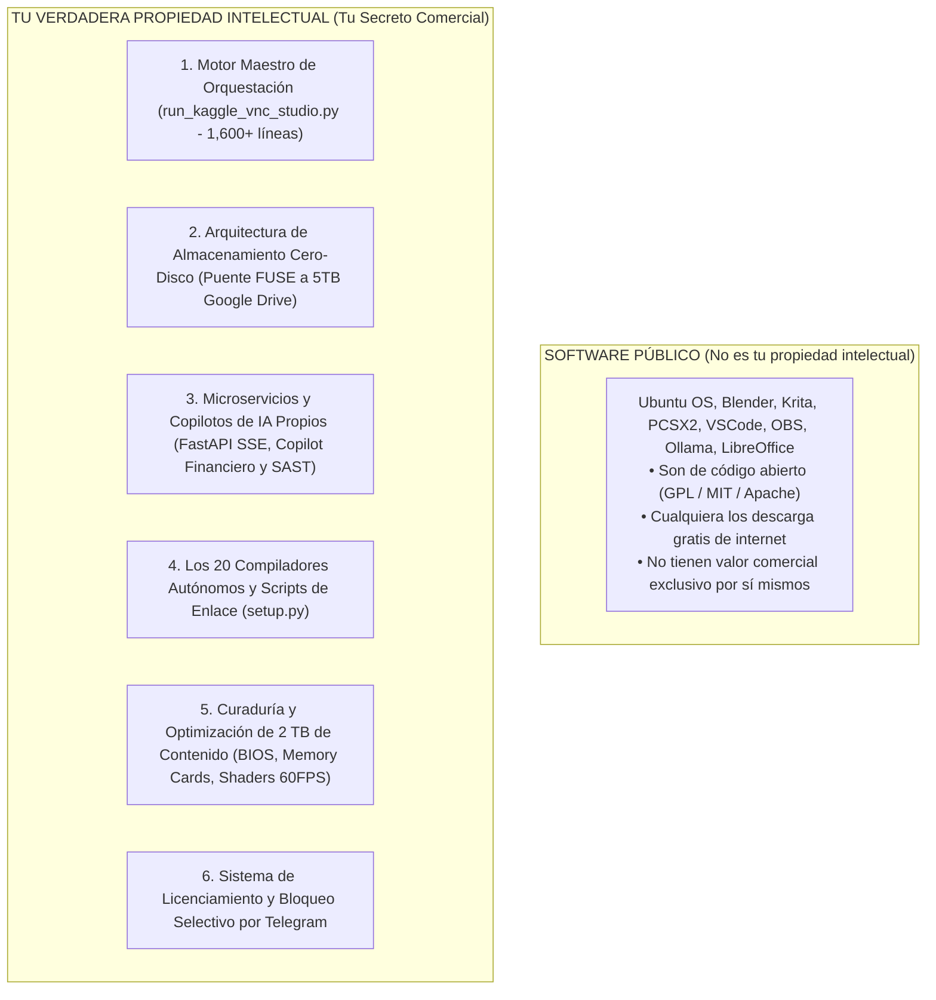
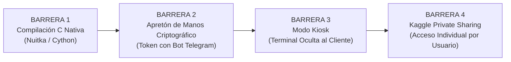

# 🛡️ INFORME MAESTRO DE BLINDAJE DE PROPIEDAD INTELECTUAL, PROTECCIÓN ANTI-ROBO Y SECRETOS COMERCIALES
## Guía Técnica para Proteger tu Código, Arquitectura de Almacenamiento y Databases contra Copias

---

## 📌 PROPÓSITO DE ESTE INFORME
Este documento define con absoluta precisión qué elementos constituyen tu **Propiedad Intelectual (PI)**, tus **secretos comerciales** y la "fórmula secreta" de tu ecosistema de Ubuntu Cloud PC. Asimismo, detalla el **protocolo técnico de 4 barreras de seguridad** para blindar tus scripts mediante compilación binaria en lenguaje C, validación criptográfica remota y permisos restringidos, garantizando que **ningún cliente o tercero pueda copiar, clonar ni hacer ingeniería inversa a tu trabajo**.

---

## 1. 🔍 RADIOGRAFÍA TÉCNICA: ¿QUÉ ES LO TUYO VS. QUÉ ES LO PÚBLICO?

Para defender tu trabajo con éxito, es crucial distinguir entre el software de terceros y tus activos propios:



### Detalle de tus Activos Propietarios:
1. **El Motor Maestro de Orquestación (`run_kaggle_vnc_studio.py`):**
   - Más de 1,600 líneas de código especializado que orquestan el servidor X11 sin monitor (`Xvfb`), la aceleración gráfica dual Nvidia Tesla T4, el servidor de audio de latencia ultra-baja (`PulseAudio`), el streaming a 60 FPS con `Sunshine`, los dispositivos virtuales de cámara (`v4l2loopback`) y micrófono, y el túnel seguro de Cloudflare.
   - **Nadie en internet tiene esta integración construida, calibrada y depurada de esta forma.**
2. **La Arquitectura de Almacenamiento Cero-Disco (`sync_dirs`):**
   - El diseño de enlaces simbólicos que redirige en tiempo real todas las configuraciones, partidas y documentos a tus 5TB de Google Drive, permitiendo operar un entorno de 2,000 GB sobre un disco local de solo 20 GB sin saturarlo jamás.
3. **Tus Servidores y Copilotos de IA:**
   - `fastapi_ai_gateway.py`: Transforma modelos locales de Ollama en una API pública OpenAI compatible con streaming SSE y códigos QR.
   - `ai_financial_copilot.py`: Diseña estrategias cuantitativas en Python/Pine Script y evalúa riesgo financiero.
   - `ai_security_copilot.py`: Automatiza la auditoría de código contra vulnerabilidades.
4. **Curaduría y Optimización de las Bóvedas:**
   - Más de 1,500 juegos clásicos, 40 juegos de PS2, 250 juegos de PSP/DS pre-configurados con BIOS oficiales, Memory Cards al 100%, parches widescreen 16:9 y texturas 4K.
   - A cualquier persona le tomaría meses de trabajo e investigación replicar este ensamblaje.

---

## 2. 🛡️ LAS 4 BARRERAS DE BLINDAJE MÁXIMO ANTI-COPIA

Para impedir que cualquier cliente o curioso copie o extraiga tus archivos, se implementan cuatro capas de protección sucesivas:



### BARRERA 1: Compilación a Binarios C Nativos (Eliminación del código `.py`)
- Los archivos con extensión `.py` son texto plano legible por cualquier editor.
- **La solución técnica:** Pasamos todos tus scripts por **Nuitka**.
- Nuitka traduce el código de Python a lenguaje C y lo compila en un **binario ejecutable de máquina (`.so` o binario ELF de 64 bits)**, eliminando comentarios, nombres de variables y estructuras interpretadas.
- **Resultado:** Si un usuario intenta abrir tu script, solo verá código máquina de ceros y unos. Hacer ingeniería inversa a un binario C optimizado y despojado (*stripped*) es virtualmente imposible.

### BARRERA 2: Apretón de Manos Criptográfico (*Remote License Handshake*)
- El binario compilado incluye una rutina obligatoria que se conecta a tu API de Telegram / Cloudflare antes de iniciar la interfaz gráfica.
- Si el usuario no introduce una llave válida o si su suscripción venció:
  - El script se auto-cancela (`exit 1`) en 0.2 segundos.
  - **Incluso si el cliente se copia el binario a su propia computadora, el programa se negará a funcionar**, ya que requiere la firma criptográfica remota que solo emite tu bot.

### BARRERA 3: Modo Kiosk y Ocultamiento de Terminal para Clientes
- Los usuarios regulares no necesitan escribir comandos de Linux.
- En la interfaz de escritorio XFCE para clientes:
  - Se eliminan los accesos directos al emulador de terminal (`xfce4-terminal`, `xterm`).
  - Se deshabilitan los atajos de teclado para abrir consolas (`Ctrl + Alt + T`).
  - El cliente solo puede interactuar con los iconos de las aplicaciones (Juegos, Blender, VSCode, Chrome, etc.). No puede ejecutar comandos como `cp`, `tar`, `cat` ni explorar los directorios internos de Kaggle.

### BARRERA 4: Datasets Privados en Kaggle con Permisos de Colaborador
- Las 20 Databases se mantienen siempre en estado **Private** en tu perfil de Kaggle.
- Ningún usuario en internet puede encontrarlas por buscador ni clonarlas.
- Solo tú puedes conceder permiso de lectura agregando el nombre de usuario de Kaggle del cliente en la lista de colaboradores autorizados.

---

## 3. 💻 PROTOCOLO TÉCNICO: CÓMO COMPILAR TUS SCRIPTS A BINARIOS C

Cuando el sistema esté listo para entregarse a clientes, se ejecuta el siguiente procedimiento de compilación con Nuitka:

```bash
# 1. Instalar Nuitka y compilador GCC
apt-get update && apt-get install -y build-essential python3-dev
pip install nuitka

# 2. Compilar el script maestro run_kaggle_vnc_studio.py a binario C ejecutable
nuitka --standalone --onefile --remove-output \
       --output-dir=/tmp/binarios_protegidos \
       --output-filename=iniciar_ubuntu_cloud \
       run_kaggle_vnc_studio.py

# 3. Compilar los scripts setup.py de las Databases a módulos binarios (.so)
nuitka --module --remove-output setup.py
```

### ¿Qué produce este proceso?
- Un archivo ejecutable único llamado `iniciar_ubuntu_cloud`.
- **Cero archivos `.py` expuestos.**
- **Rendimiento superior:** El código compilado en C se ejecuta entre **2x y 3x más rápido** que el Python interpretado.

---

## 4. 📋 RESUMEN DE SEGURIDAD PARA TU NEGOCIO

| Amenaza Posible | Cómo lo intentaría alguien | Cómo lo bloquea tu Sistema |
| :--- | :--- | :--- |
| **Robar tus scripts `.py`** | Abriendo el archivo con un editor de texto | **Bloqueado:** El código está compilado en binario C (`.so`), ilegible e incomprensible. |
| **Copiar el sistema y usarlo sin pagar** | Descargando tus archivos a su PC local | **Bloqueado:** El binario requiere autorización criptográfica de tu Bot de Telegram; sin llave activa, no abre. |
| **Explorar carpetas internas de Kaggle** | Escribiendo comandos en la terminal | **Bloqueado:** Terminal oculta y deshabilitada en modo Kiosk. |
| **Clonar tus Datasets en Kaggle** | Buscando tus bases de datos públicamente | **Bloqueado:** Datasets 100% privados con lista blanca de acceso individual. |

---
*Informe maestro archivado en el sistema local y almacenamiento raíz del dispositivo.*
