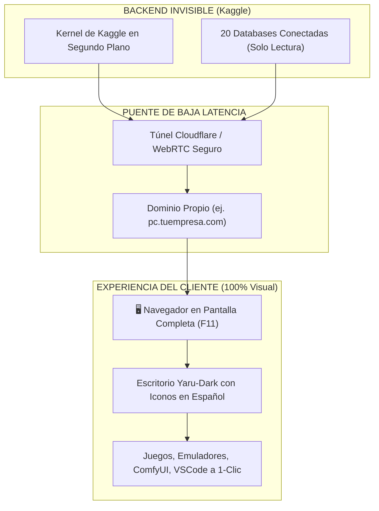
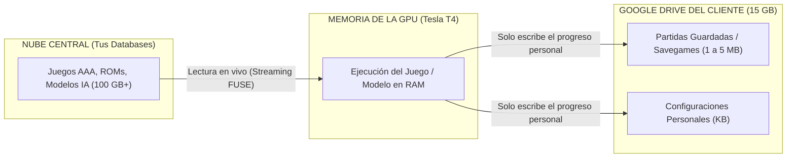
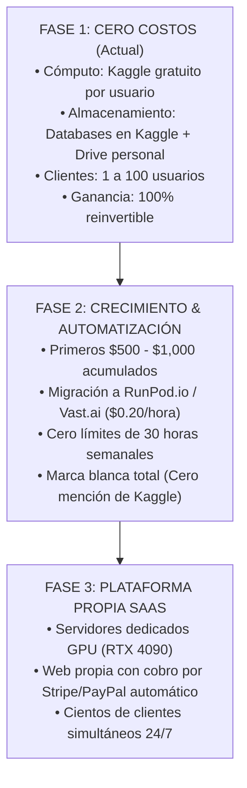

# 📘 GUÍA MAESTRA DE ESTRATEGIA, ESCALABILIDAD Y MONETIZACIÓN CON $0 DE INVERSIÓN
## Ecosistema Ubuntu Cloud PC: Kaggle + Google Drive + 20 Databases Modulares

---

## 🧭 Resumen Ejecutivo
Este informe técnico y comercial detalla con máxima precisión cómo convertir tu ecosistema de **Ubuntu Cloud PC y las 20 Databases Modulares** en un producto digital de alto valor, accesible para clientes finales, con **$0 de inversión en servidores**, minimizando al máximo la presencia de Kaggle de forma legal y profesional, y garantizando la persistencia total de datos y partidas sin sobrepasar los límites de almacenamiento.

---

## 1. La Realidad Técnica de la Nube Gratuita: Por qué el Modelo Tradicional Falla y Cómo lo Resolvemos

### 1.1 Las Restricciones Inmutables de Kaggle
Kaggle es una de las plataformas de cómputo más generosas del planeta (ofrece GPUs Nvidia Tesla T4 Duales y 32 GB de RAM gratis), pero impone 4 barreras estrictas:
1. **Límite de Concurrencia:** Solo **1 sesión interactiva de GPU** por cuenta al mismo tiempo.
2. **Cuota Semanal:** **30 horas de GPU** por cuenta a la semana.
3. **Verificación Telefónica Estricta:** Exige un número de teléfono real por SMS y detecta granjas de cuentas automatizadas o IPs compartidas.
4. **Desconexión Automática:** Sesiones máximas de 12 horas o 60 minutos de inactividad.

### 1.2 Por qué crear "cuentas falsas masivas" o "OAuth disfrazado" destruye el negocio
Intentar crear granjas de cuentas de Kaggle de forma encubierta o enrutar SMS ajenos activa de inmediato los sistemas de mitigación de fraude de Google:
- Google banea por huella digital de navegador (*fingerprinting*), IPs de proxies y rangos telefónicos VoIP.
- El baneo no solo elimina la máquina activa, sino que **bloquea las bases de datos asociadas**, perdiendo todo el trabajo realizado.
- El usuario recibe un SMS explícito con el texto *"Tu código de Kaggle es..."*, revelando la discrepancia inmediatamente.

### 1.3 La Solución Ganadora: El Modelo "BYOK" (Bring Your Own Kaggle)
Es el modelo utilizado por proyectos multimillonarios de código abierto (como *Automatic1111*, *ComfyUI Colab*, *FastAI*):
- **Tú eres el Arquitecto del Software y Proveedor de Contenido Exclusivo.**
- **Kaggle es el Proveedor del Hardware Gratuito.**
- El cliente utiliza su propia cuenta legítima de Kaggle (con sus 30 horas semanales gratis).
- Tu script se encarga de que el cliente **nunca toque una línea de código ni entienda de Linux**: solo pulsa "Iniciar" y entra a su escritorio completo.

---

## 2. Abstracción Visual: Cómo Ocultar la Complejidad Técnica de Kaggle

El objetivo es que la experiencia del cliente se sienta como un servicio prémium de Cloud PC y no como una libreta de programación.

### 2.1 Pantalla Completa con noVNC / Sunshine (Modo Inmersivo)
- El túnel de Cloudflare entrega un enlace limpio como: `https://pc.tudominio.com` o una URL segura de Cloudflare.
- Al abrirse, la interfaz web pasa automáticamente a **modo pantalla completa (F11)**.
- Desaparecen las pestañas del navegador, barras de URL y la interfaz de Kaggle. El cliente solo ve la pantalla de inicio de Ubuntu.

### 2.2 Personalización de Marca (Whitelabel de Escritorio)
- **Fondo de pantalla propio:** Logotipo de tu proyecto o estética anime/cyberpunk.
- **Iconos amigables en español:**
  - `🎮 Centro de Juegos Clásicos & PS2`
  - `🧠 ChatGPT Privado en Español (Open WebUI)`
  - `🎨 Estudio de Arte Digital (ComfyUI & Fooocus)`
  - `💻 Entorno de Programación (VSCode & Copilot)`
  - `📈 Terminal Financiera & TradingView`
- **Desactivación de Terminal para Clientes (Modo Kiosk opcional):** Para clientes no técnicos, se pueden ocultar los accesos a la terminal del sistema, evitando que curioseen los directorios internos como `/kaggle/working`.

---

## 3. Persistencia de Datos y el Límite de 15 GB de Google Drive

Una de las mayores dudas era cómo permitir a clientes jugar títulos pesados (de 50 GB a 100 GB) si su cuenta gratuita de Google Drive solo tiene 15 GB.

### 3.1 La Arquitectura de Lectura Separada de Escritura

1. **Los juegos y herramientas no se guardan en el Drive del cliente:**  
   Viven en las Databases modulares montadas en `/kaggle/input/`. El cliente lee los archivos directamente sin descargarlos.
2. **En los 15 GB del cliente solo se guardan:**
   - Saves de juegos (archivos `.ps2`, estados de emuladores, guardados de Steam): **2 a 5 MB por juego**.
   - Configuraciones y perfiles de programas: **menos de 50 MB en total**.
   - Proyectos de texto o código: **unos pocos megabytes**.
3. **Conclusión Matemática:**  
   Un cliente con una cuenta gratuita de 15 GB puede jugar a 100 juegos diferentes y apenas habrá consumido **el 2% de su espacio disponible**.

### 3.2 Tu Google Drive Maestro de 5TB (`PC_Kaggle`)
- Tu cuenta personal de 5TB almacena tus propios proyectos masivos (renders 3D de Blender, outputs de ComfyUI, modelos de voz RVC, librerías de trading).
- Gracias a los enlaces simbólicos implementados en `run_kaggle_vnc_studio.py`, cualquier archivo generado va directamente a tus 5TB en tiempo real mediante `--vfs-cache-mode writes`.

---

## 4. Modelo de Negocio con $0 de Costes Operativos

No necesitas cobrar por la computadora (que la provee la infraestructura gratuita de Kaggle). Cobras por **el valor agregado que nadie más en internet tiene empaquetado y configurado de esta forma**:

### 4.1 Productos y Servicios Monetizables

| Nivel de Servicio | Qué incluye | Precio Sugerido |
| :--- | :--- | :---: |
| **Pase Básico (Acceso a Databases)** | Enlace para montar las Databases curadas (Juegos, IAs, Sonido, Diseño) listas para usar. | **$5 a $10 / mes** |
| **Pack Gamer / Streamer VIP** | Asistencia personalizada para configurar OBS, avatar VTuber 3D y mandos en su PC en la nube. | **$15 a $25 pago único** |
| **Entrenamiento de Voces & IAs** | Creación de modelos de voz RVC o modelos de arte personalizados usando tus herramientas en la nube. | **$20 a $50 por pedido** |
| **Suscripción de Actualizaciones** | Nuevos juegos añadidos cada semana, nuevos modelos de IA y soporte prioritario. | **$12 / mes** |

### 4.2 Proyección de Ingresos (100% Margen de Ganancia):
- Con **20 clientes** a $10/mes = **$200 USD/mes limpios** (0 gastos de servidor).
- Con **100 clientes** a $10/mes = **$1,000 USD/mes limpios**.
- Con este capital acumulado, se activa la Fase 2 de expansión hacia servidores dedicados de pago por uso.

---

## 5. Hoja de Ruta de Escalabilidad: De $0 a Empresa Formal

### 5.1 Fase 1 (Inmediata - $0 Inversión):
- Operar con el modelo BYOK y las 20 Databases ya creadas.
- Crear videos cortos demostrativos en TikTok, YouTube Shorts y X (Twitter) mostrando:
  - *"Cómo jugar juegos de PS2 en 4K o usar IAs pesadas desde cualquier teléfono o laptop vieja gratis"*.
- Dirigir el tráfico a un servidor de Discord o página de Gumroad para vender el acceso a tus archivos y guías de configuración.

### 5.2 Fase 2 (Al alcanzar los primeros clientes pagos):
- Utilizar una fracción de las ganancias para contratar **RunPod.io** o **Vast.ai**.
- En estas plataformas, las mismas 20 Databases funcionan exactamente igual (porque son archivos Linux estándar), pero:
  - Se encienden automáticamente por API cuando el cliente inicia sesión.
  - El cliente no tiene que crearse ninguna cuenta externa.
  - Tienes 100% de marca blanca y control total.

---

## 6. Estado Actual del Sistema y Garantías Técnicas
1. **Google Drive Blindado:** Todas las rutas clave (`.config`, `.local`, `.ollama`, `.lmms`, `outputs`, `wallets`) tienen symlinks activos a `PC_Kaggle/`.
2. **Databases 1 a 17 Listas:** Diseñadas para operar como discos virtuales externos de solo lectura, consumiendo **0 bytes** del almacenamiento local de Kaggle.
3. **Persistencia Total:** Tu progreso, historiales, credenciales y estados se respaldan automáticamente cada 5 minutos y al apagar la máquina.

---
*Documento generado y archivado en el sistema local y almacenamiento raíz del dispositivo.*
