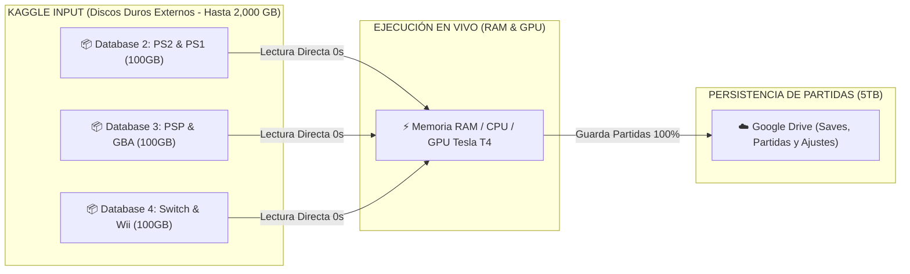

# 🐧 REPORTE OFICIAL: ECOSISTEMA DE 20 DATABASES MODULARES UBUNTU (2,000 GB)

Este documento detalla la arquitectura modular oficial del ecosistema de **Ubuntu Cloud PC**. Cada base de datos está diseñada como un cartucho independiente de hasta 100GB que se puede conectar o descargar a demanda con 1 solo clic desde el escritorio, sin tocar ni saturar el límite de 20GB local.

---

## 📋 ESTADO GENERAL DEL CATÁLOGO DE 20 DATABASES

| # | Nombre de la Database | Slug Oficial | Categoría | Estado Actual |
| :-: | :--- | :--- | :--- | :---: |
| **1** | **Ubuntu - Core Desktop & Social Hub** | `ubuntu-core-os-social` | **Sistema Base & Redes** | **[✅ HECHO / LISTO]** |
| **2** | **Ubuntu - Emuladores PS2 & PS1** | `ubuntu-ps2-ps1-vault` | **Gaming Retro** | **[⚙️ EN COMPILACIÓN / LISTO]** |
| **3** | **Ubuntu - Emuladores PSP & Nintendo DS/GBA** | `ubuntu-psp-ds-gba-vault` | **Gaming Portátil** | **[⚙️ LISTO PARA COMPILAR]** |
| **4** | **Ubuntu - Emuladores Switch & Wii/GameCube** | `ubuntu-switch-wii-vault` | **Gaming Nintendo** | **[⚙️ LISTO PARA COMPILAR]** |
| **5** | **Ubuntu - Arcade Retro & Clásicos** | `ubuntu-arcade-retro-classics` | **Gaming Arcade** | **[⚙️ LISTO PARA COMPILAR]** |
| **6** | **Ubuntu - PC Gaming & Launchers** | `ubuntu-pc-gaming-launchers` | **PC Gaming** | **[⚙️ LISTO PARA COMPILAR]** |
| **7** | **Ubuntu - 3D Avatar & VTuber Studio** | `ubuntu-3d-avatar-studio` | **Creadores & 3D** | **[⚙️ LISTO PARA COMPILAR]** |
| **8** | **Ubuntu - Suite Streamer OBS Pro** | `ubuntu-streamer-obs-pro` | **Streaming & Video** | **[⚙️ LISTO PARA COMPILAR]** |
| **9** | **Ubuntu - Diseño Gráfico & Ilustración** | `ubuntu-graphic-design-art` | **Arte 2D** | **[⚙️ LISTO PARA COMPILAR]** |
| **10** | **Ubuntu - Modelado 3D Blender & VFX** | `ubuntu-3d-blender-vfx` | **3D & VFX** | **[⚙️ LISTO PARA COMPILAR]** |
| **11** | **Ubuntu - Cerebro IA Ollama & Llama** | `ubuntu-ai-brains-ollama` | **Inteligencia Artificial** | **[⚙️ LISTO PARA COMPILAR]** |
| **12** | **Ubuntu - Laboratorio de Voz & Audio IA** | `ubuntu-ai-voice-audio-lab` | **Audio & Voz IA** | **[⚙️ LISTO PARA COMPILAR]** |
| **13** | **Ubuntu - Generador de Arte ComfyUI SDXL** | `ubuntu-ai-image-comfyui` | **Arte & Imagen IA** | **[⚙️ LISTO PARA COMPILAR]** |
| **14** | **Ubuntu - Producción Musical LMMS Studio** | `ubuntu-music-audio-studio` | **Música & Audio** | **[⚙️ LISTO PARA COMPILAR]** |
| **15** | **Ubuntu - Suite Desarrollador & VSCode** | `ubuntu-developer-code-hub` | **Programación & IA** | **[⚙️ LISTO PARA COMPILAR]** |
| **16** | **Ubuntu - Laboratorio Ciberseguridad Pentesting** | `ubuntu-cybersecurity-lab` | **Seguridad & Redes** | **[⚙️ LISTO PARA COMPILAR]** |
| **17** | **Ubuntu - Trading Cripto & Finanzas** | `ubuntu-crypto-trading-desk` | **Finanzas & Cripto** | **[⚙️ LISTO PARA COMPILAR]** |
| **18** | **Ubuntu - Universidad & Ciencia Hub** | `ubuntu-student-university-hub` | **Educación & Ciencia** | **[⚙️ LISTO PARA COMPILAR]** |
| **19** | **Ubuntu - Anime Manga & Entretenimiento** | `ubuntu-anime-manga-media` | Entretenimiento | [⏳ Planificado] |
| **20** | **Ubuntu - Herramientas de Rescate & Diagnóstico** | `ubuntu-sysadmin-rescue-tools` | Mantenimiento | [⏳ Planificado] |

---

## 🔍 DETALLE TÉCNICO DE CADA DATABASE

---

### 🌟 DATABASE 1: `Ubuntu - Core Desktop & Social Hub` **[✅ HECHO / LISTO]**
* **Slug:** `ubuntu-core-os-social`
* **Tamaño:** ~1.2 GB
* **Tiempo de Arranque:** **< 10 segundos**
* **Propósito:** El sistema operativo base limpio, universal y sin marcas de avatares. Todo usuario o cliente arranca desde aquí.
* **Contenido Completo:**
  - **Entorno Gráfico:** XFCE 4.18 optimizado con tema oscuro oficial Ubuntu Yaru-Dark e iconos Papirus.
  - **Servidor VNC & noVNC:** Puerto 5900 (TCP binario) y Puerto 6080 (Web) con **Motor de Trackpad Táctil de Laptop integrado** (deslizar dedo para mover el ratón).
  - **Servidor Sunshine (Moonlight):** Streaming H.264/HEVC acelerado por hardware GPU a 60/120 FPS.
  - **Redes Sociales & Comunicación:**
    - **Discord:** Cliente oficial para llamadas y comunidades.
    - **Telegram Desktop:** Mensajería instantánea y canales.
    - **WhatsApp Web (PWA):** Acceso directo como app nativa.
    - **Spotify & YouTube Music (PWA):** Música en segundo plano.
    - **Twitter / X & Instagram (PWA):** Redes sociales con ventana independiente.
    - **Google Meet & Zoom:** Videollamadas y reuniones.
    - **Google Chrome Oficial:** Navegador con aceleración GPU.
  - **Productividad & Utilidades Diarias:**
    - **Flameshot:** Capturas de pantalla profesionales con flechas, texto y pixelado.
    - **CopyQ:** Historial avanzado de portapapeles.
    - **LibreOffice Suite:** Writer (Word), Calc (Excel), Impress (PowerPoint).
    - **Evince / Xreader:** Visor ligero de PDFs y documentos.
    - **PeaZip / 7-Zip / Unrar:** Gestor total de archivos comprimidos.
    - **qBittorrent:** Descargas P2P ultrarrápidas a tus 5TB de Google Drive.
    - **VLC Media Player:** Reproductor multimedia con códecs universales.
    - **FileZilla:** Cliente FTP/SFTP.
    - **Google Drive 5TB FUSE:** Montaje automático en `/root/gdrive/PC_Kaggle`.
  - **Conectividad Avanzada, Red Local, VPN Mesh & Móvil:**
    - **Tailscale & WireGuard (Mesh VPN):** Conecta la máquina en la nube directamente a tu red local doméstica (LAN) para comunicarte con tus laptops, impresoras, PCs y servidores locales (`192.168.1.x`) como si estuvieran en la misma habitación.
    - **KDE Connect & Sincronización Móvil:** Compartición instantánea de portapapeles (copiar en el teléfono y pegar en Ubuntu), transferencia inalámbrica de archivos, control multimedia y notificaciones del móvil en pantalla.
    - **Cámara Web Virtual (`v4l2loopback` / `/dev/video0`):** Permite conectar la cámara de tu teléfono móvil o cámara web física a través de la red/WebRTC para que apps como VSeeFace, OpenSeeFace, Discord y Google Meet la detecten como una cámara física USB.
    - **Micrófono Virtual (PulseAudio / ALSA Loopback):** Transmisión de voz en tiempo real (<50ms) desde el micrófono de tu teléfono o auriculares hacia Ubuntu para transcripción en vivo (Whisper), modulación (RVC) o llamadas.
    - **Herramientas de Monitoreo de Red Gigabit:** `Nethogs`, `Iftop`, `Iperf3` y `Avahi` (ZeroConf/mDNS) para diagnosticar ancho de banda y dispositivos conectados.
    - **Onboard:** Teclado virtual en pantalla para escribir desde móviles y tablets.
    - **AntiMicroX:** Calibrador y mapeador de mandos y controles Bluetooth/USB.
    - **Pavucontrol:** Mezclador de audio profesional para regular volúmenes independientes.
    - **Redshift:** Filtro de luz azul y modo noche para cuidar la vista.
  - **Centro de Software 1-Clic:** Acceso directo en el escritorio para instalar cualquiera de los otros 19 módulos con 1 clic.

---

### 🕹️ DATABASE 2: `Ubuntu - Emuladores PS2 & PS1` **[⚙️ EN COMPILACIÓN / LISTO]**
* **Slug:** `ubuntu-ps2-ps1-vault` | **Capacidad:** 100 GB
* **Propósito:** Consola PlayStation 2 y PlayStation 1 definitiva con resolución escalada a 1080p 60FPS, BIOS oficiales completas, Memory Cards 100% y catálogo curado en formato ultra-comprimido CHD/PBP.
* **Emuladores & Mejoras Gráficas:**
  - **PCSX2 (Qt 64-bit v2.0):** Emulador oficial de PS2 con renderizado Vulkan/OpenGL, reescalado interno 1080p/4K, filtro anisotrópico 16x y parches panorámicos 16:9 automáticos.
  - **DuckStation (PS1 PGXP HD):** Emulador de PS1 con eliminación total de temblores poligonales (PGXP Geometry Correction), texturas suavizadas y audio sincronizado.
  - **Pack Maestro de BIOS Oficiales:** SCPH-70012 (USA), SCPH-70004 (EUR), SCPH-70000 (JAP), SCPH-1001 y SCPH-5501.
  - **Memory Cards Virtuales:** Tarjetas de 8MB y 128KB con partidas completadas al 100% para desbloquear todos los personajes y pistas.
  - **Compatibilidad de Mandos:** Perfiles preconfigurados para mandos de PS4, PS5, Xbox One/Series y genéricos USB/Bluetooth.
* **Catálogo de Juegos de PlayStation 2 (Formato CHD/ISO):**
  - *Dragon Ball Z: Budokai Tenkaichi 3 (Versión Latino con voces en español)*
  - *God of War (1 & 2)*
  - *Grand Theft Auto: San Andreas & Vice City*
  - *Def Jam: Fight for NY*
  - *Resident Evil 4 & Silent Hill 2*
  - *Need for Speed: Underground 2 & Most Wanted (Black Edition)*
  - *Black & Shadow of the Colossus*
  - *Devil May Cry 3: Dante's Awakening (Special Edition)*
  - *Mortal Kombat: Shaolin Monks & Tekken 5*
  - *Bully (Canis Canem Edit) & Burnout 3: Takedown*
  - *Kingdom Hearts II & Naruto Shippuden: Ultimate Ninja 5*
  - *Marvel vs Capcom 2*
* **Catálogo de Juegos de PlayStation 1 (Formato CHD/PBP):**
  - *Crash Bandicoot 1, 2, 3 Warped & Crash Team Racing (CTR)*
  - *Resident Evil 1, 2 & 3 Nemesis*
  - *Silent Hill & Metal Gear Solid*
  - *Castlevania: Symphony of the Night & Tekken 3*
  - *Pepsiman, Gran Turismo 2 & Dino Crisis 2*
  - *Yu-Gi-Oh! Forbidden Memories (Mod 15 Drop)*
  - *Jackie Chan Stuntmaster & Tony Hawk's Pro Skater 2*
  - *Spider-Man (2000) & Marvel Super Heroes vs Street Fighter*
* **Activación 1-Clic (`setup.py`):**
  - Al conectarse a Kaggle o descargarse desde el escritorio, crea automáticamente los accesos directos:
    - `🎮 PlayStation 2 (PCSX2 1080p HD).desktop`
    - `🎮 PlayStation 1 (DuckStation PGXP).desktop`
    - `📂 Carpeta de Juegos PS2 & PS1 (ROMs).desktop`

---

### 📱 DATABASE 3: `Ubuntu - Emuladores PSP & Nintendo DS/GBA` **[⚙️ EN COMPILACIÓN / LISTO]**
* **Slug:** `ubuntu-psp-ds-gba-vault` | **Capacidad:** 100 GB
* **Propósito:** Bóveda completa de consolas portátiles (Sony PSP, Nintendo DS, Game Boy Advance, Game Boy Color) con más de 250 títulos legendarios, BIOS oficiales, parches de 60 FPS y texturas HD.
* **Emuladores & Mejoras Visuales:**
  - **PPSSPP (Qt 64-bit v1.17+):** El mejor emulador de PSP con aceleración Vulkan, reescalado interno **4K / 5K**, shaders de color vibrante, cheats de 60 FPS y compatibilidad total con mandos.
  - **melonDS (OpenGL 3D):** Emulador de Nintendo DS de alta fidelidad con reescalado 3D por hardware, emulación táctil por ratón/trackpad, layouts de pantalla vertical/horizontal y soporte de Wi-Fi local.
  - **mGBA (Oficial Standalone & Qt):** Emulador ultra-preciso de Game Boy Advance / Color con soporte para reloj en tiempo real (RTC para Pokémon) y parches de Romhacks.
  - **Pack Maestro de BIOS:** `gba_bios.bin` (con logo y sonido clásico de Nintendo), `bios7.bin`, `bios9.bin` y `firmware.bin` de NDS.
* **Catálogo de Juegos Sony PSP (Formato CSO / ISO 60 FPS):**
  - *God of War: Ghost of Sparta & Chains of Olympus*
  - *Grand Theft Auto: Liberty City Stories, Vice City Stories & Chinatown Wars*
  - *Tekken 6 & Tekken: Dark Resurrection*
  - *Monster Hunter Freedom Unite & Portable 3rd HD*
  - *Dragon Ball Z: Shin Budokai 1 & 2 (Another Road)*
  - *Dragon Ball Z: Tenkaichi Tag Team (Mod Super con transformaciones)*
  - *Naruto Shippuden: Ultimate Ninja Impact*
  - *Crisis Core: Final Fantasy VII & Kingdom Hearts: Birth by Sleep*
  - *Persona 3 Portable & Metal Gear Solid: Peace Walker*
  - *Need for Speed: Most Wanted 5-1-0 & Midnight Club 3 DUB Edition*
  - *Burnout Legends, Dante's Inferno & Assassin's Creed Bloodlines*
  - *Silent Hill: Origins & Def Jam: Fight for NY The Takeover*
  - *The 3rd Birthday, Castlevania The Dracula X Chronicles & Yu-Gi-Oh! GX Tag Force 3*
* **Catálogo de Juegos Nintendo DS (Formato NDS):**
  - *Pokémon HeartGold & SoulSilver, Pokémon Negro & Blanco (1 & 2), Pokémon Platino*
  - *New Super Mario Bros, Mario Kart DS & Super Mario 64 DS*
  - *The Legend of Zelda: Phantom Hourglass & Spirit Tracks*
  - *Chrono Trigger DS, Castlevania: Dawn of Sorrow & Order of Ecclesia*
  - *Mario & Luigi: Bowser's Inside Story, Phoenix Wright Ace Attorney*
  - *Kingdom Hearts: 358/2 Days & Metroid Prime Hunters*
* **Catálogo de Juegos Game Boy Advance (Formato GBA / Romhacks):**
  - *Pokémon Esmeralda, Pokémon Rojo Fuego & Verde Hoja*
  - *Los Mejores Romhacks Legendarios:* *Pokémon Radical Red, Pokémon Unbound (Edición Maestra), Pokémon Gaia & Pokémon Glazed.*
  - *The Legend of Zelda: The Minish Cap & A Link to the Past*
  - *Metroid Fusion & Metroid: Zero Mission*
  - *Castlevania: Aria of Sorrow & Circle of the Moon*
  - *Golden Sun 1 & 2, Mega Man Battle Network 6, Fire Emblem The Sacred Stones*
  - *Advance Wars 2, Super Mario Advance 4 & Mario Kart Super Circuit*
  - *Sonic Advance 3, Dragon Ball Z: Buu's Fury & Yu-Gi-Oh! The Sacred Cards*
* **Activación 1-Clic (`setup.py`):**
  - Al conectarse a Kaggle o descargarse desde el escritorio, crea automáticamente los accesos directos:
    - `🎮 Sony PSP (PPSSPP 4K HD).desktop`
    - `📱 Nintendo DS (melonDS 3D HD).desktop`
    - `🕹️ Game Boy Advance (mGBA Oficial).desktop`
    - `📂 Carpeta de Juegos Portatiles (PSP, DS, GBA).desktop`

---

### 🍄 DATABASE 4: `Ubuntu - Emuladores Switch & Wii/GameCube` **[⚙️ LISTO PARA COMPILAR]**
* **Slug:** `ubuntu-switch-wii-vault` | **Capacidad:** 100 GB
* **Propósito:** Bóveda de Nintendo moderna y clásica (Nintendo Switch, Wii, GameCube & Wii U) con emulación a 1080p/4K 60 FPS acelerada por GPU Tesla T4, keys/firmware oficiales y catálogo curado en formato ultra-comprimido (NSP, RVZ, WUA).
* **Emuladores & Mejoras Gráficas:**
  - **Ryujinx (64-bit Oficial para Linux):** Emulador insignia de Nintendo Switch con soporte completo de Vulkan, shaders SPIR-V, resolución Docked (1080p/2K/4K) y mods de desbloqueo de 60 FPS.
  - **Dolphin Emulator (Oficial Master):** Emulador legendario de GameCube y Wii con reescalado 1080p/4K, parches de pantalla ancha 16:9, shaders de post-procesado y emulación de Wiimote con ratón o mando.
  - **Cemu (Wii U Native Linux):** Emulador nativo de Wii U con Graphic Packs (FPS++, mejoras de texturas y resolución Ultra HD).
  - **Pack de Keys y Firmware:** `prod.keys`, `title.keys` y Firmware de Switch pre-cargados para máxima compatibilidad de juegos.
* **Catálogo de Juegos Nintendo Switch (Formato NSP / XCI):**
  - *Super Mario Odyssey*
  - *Mario Kart 8 Deluxe (con Booster Course Pass)*
  - *Super Smash Bros. Ultimate*
  - *The Legend of Zelda: Breath of the Wild & Tears of the Kingdom*
  - *Pokémon Legends: Arceus & Pokémon Scarlet / Violet*
  - *Super Mario Bros. Wonder & Metroid Dread*
  - *Animal Crossing: New Horizons & Luigi's Mansion 3*
  - *Kirby and the Forgotten Land & Donkey Kong Country: Tropical Freeze*
  - *Hollow Knight (Switch Edition)*
* **Catálogo de Juegos Nintendo GameCube (Formato RVZ 60 FPS):**
  - *Super Smash Bros. Melee (Versión Torneo 60 FPS)*
  - *Mario Kart: Double Dash!!*
  - *The Legend of Zelda: The Wind Waker & Twilight Princess*
  - *Super Mario Sunshine & Metroid Prime 1 & 2: Echoes*
  - *Luigi's Mansion, Resident Evil (Remake) & Resident Evil Zero*
  - *F-Zero GX (Carreras ultra-rápidas a 60 FPS)*
  - *Paper Mario: The Thousand-Year Door & Pokémon Colosseum*
  - *Soulcalibur II (con Link jugable)*
* **Catálogo de Juegos Nintendo Wii & Wii U (Formato RVZ / WUA):**
  - *Mario Kart Wii (60 FPS con mods de circuitos)*
  - *Super Smash Bros. Brawl (Project+)*
  - *Super Mario Galaxy 1 & 2*
  - *The Legend of Zelda: Skyward Sword & Xenoblade Chronicles*
  - *Donkey Kong Country Returns & New Super Mario Bros. Wii*
  - *Metroid Prime Trilogy, Wii Sports & Wii Sports Resort*
  - *The Legend of Zelda: Breath of the Wild (Wii U Edition 60 FPS)*
  - *Super Mario 3D World (Wii U)*
* **Activación 1-Clic (`setup.py`):**
  - Al conectarse a Kaggle o descargarse desde el escritorio, crea automáticamente los accesos directos:
    - `🍄 Nintendo Switch (Ryujinx 1080p/4K).desktop`
    - `🐬 Nintendo GameCube & Wii (Dolphin HD).desktop`
    - `🎮 Nintendo Wii U (Cemu 60 FPS).desktop`
    - `📂 Carpeta de Juegos Nintendo (Switch, Wii, GC).desktop`

---

### 👾 DATABASE 5: `Ubuntu - Arcade Retro & Clásicos` **[⚙️ LISTO PARA COMPILAR]**
* **Slug:** `ubuntu-arcade-retro-classics` | **Capacidad:** 100 GB
* **Propósito:** La sala arcade definitiva y centro de consolas de 16/32 bits con más de 1,500 clásicos legendarios, emuladores profesionales (RetroArch, MAME, FBNeo), BIOS completas (NeoGeo, QSound, PGM), filtros CRT analógicos y latencia cero (Run-Ahead).
* **Emuladores & Mejoras Visuales:**
  - **RetroArch (Vulkan/Ozone 64-bit v1.17+):** Interfaz fluida multiconsola con soporte para Netplay (jugar online 2 jugadores gratis), rebobinado en tiempo real y reducción de latencia por frame (Run-Ahead).
  - **MAME (Oficial Standalone):** El estándar de oro para recreativas clásicas con paquete de audio samples (`qsound.zip`, samples WAV).
  - **FinalBurn Neo (FBNeo Standalone & Core):** Motor ultra-rápido especializado en juegos de lucha arcade y shoot'em ups a 60 FPS clavados.
  - **Shaders CRT Profesionales:** `CRT-Royale` (simula un televisor Trinitron 4K de tubo), `CRT-Easymode` (scanlines limpias) y efectos de resplandor de fósforo arcade.
  - **Pack de BIOS Arcade:** `neogeo.zip` (Universe BIOS v4.0), `qsound.zip` (Capcom CPS-2), `pgm.zip` (IGS) y `decocass.zip`.
* **Catálogo de Juegos SNK Neo Geo & Arcade Fighting:**
  - *Colección Completa The King of Fighters: KOF 94, 95, 96, 97, 98 (The Slugfest), 99, 2000, 2001, 2002 (Magic Plus II & Unlimited Match), 2003.*
  - *Saga Completa Metal Slug: Metal Slug 1, 2, X, 3, 4, 5.*
  - *Garou: Mark of the Wolves, Samurai Shodown (I al V Special), Fatal Fury Special & Real Bout 2.*
  - *World Heroes Perfect, Aero Fighters 2 & 3, Shock Troopers 1 & 2, Windjammers, Sengoku 3.*
* **Catálogo de Juegos Capcom CPS & Beat 'em Up Arcades:**
  - *Street Fighter II (Champion Edition, Turbo, Super Turbo) & Street Fighter Alpha (1, 2, 3).*
  - *Street Fighter III 3rd Strike - Fight for the Future.*
  - *Marvel vs Capcom, X-Men vs Street Fighter, Marvel Super Heroes & Darkstalkers.*
  - *Cadillacs and Dinosaurs, The Punisher, Captain Commando, Aliens vs Predator, Knights of the Round, Final Fight.*
  - *Teenage Mutant Ninja Turtles & Turtles in Time, The Simpsons Arcade Game, Sunset Riders, X-Men 6 Players.*
  - *Mortal Kombat (1, 2, 3, Ultimate Mortal Kombat 3), Killer Instinct 1 & 2, NBA Jam Tournament Edition.*
  - *Dodonpachi, Ikaruga, 1941/1942/1943/1944, Raiden II, Strikers 1945 III, Snow Bros 1 & 2.*
* **Catálogo de Juegos Super Nintendo (SNES) & Sega Genesis:**
  - *Super Mario World (1 & 2 Yoshi's Island), Super Mario All-Stars, Super Mario Kart, Super Mario RPG.*
  - *The Legend of Zelda: A Link to the Past, Super Metroid, Donkey Kong Country 1, 2, 3.*
  - *Chrono Trigger, Final Fantasy III (VI), Secret of Mana, EarthBound, Mega Man X (1, 2, 3), Super Castlevania IV, Contra III.*
  - *Sonic the Hedgehog (1, 2, 3 & Sonic & Knuckles), Streets of Rage 1, 2, 3, Golden Axe 1, 2, 3, Shinobi III, Comix Zone, Gunstar Heroes.*
* **Activación 1-Clic (`setup.py`):**
  - Al conectarse a Kaggle o descargarse desde el escritorio, crea automáticamente los accesos directos:
    - `👾 Sala Arcade Retro (RetroArch 4K CRT).desktop`
    - `🕹️ MAME Arcade Master (Oficial).desktop`
    - `📂 Carpeta de Juegos Arcade & Clasicos (1500+ ROMs).desktop`

---

### 🏆 DATABASE 6: `Ubuntu - PC Gaming & Launchers` **[⚙️ LISTO PARA COMPILAR]**
* **Slug:** `ubuntu-pc-gaming-launchers` | **Capacidad:** 100 GB
* **Propósito:** La plataforma definitiva de PC Master Race para jugar títulos nativos de Steam, Epic Games, GOG y Windows en Linux con aceleración por hardware NVIDIA Tesla T4, capas de traducción Vulkan (Proton-GE / DXVK / VKD3D) y optimizadores de FPS.
* **Launchers & Plataformas Integradas:**
  - **Steam Oficial para Linux:** Con soporte multi-arquitectura de 32-bit (i386) pre-configurado para ejecutar tanto juegos nativos de Linux como el 95% del catálogo de Windows.
  - **Heroic Games Launcher (Epic Games & GOG):** Cliente visual de alto rendimiento con sincronización automática de partidas en la nube de Epic Games Store y GOG.
  - **Lutris Gaming Platform:** Gestor universal para conectar librerías de EA App, Ubisoft Connect, Battle.net, GOG y juegos independientes.
  - **Bottles (Windows Sandboxed Apps):** Gestor de prefijos Wine con dependencias preinstaladas (DirectX 9/10/11/12, Visual C++ 2005-2022, .NET Framework 4.8, PhysX).
* **Capas de Traducción & Herramientas de Rendimiento (GPU Tesla T4):**
  - **Proton-GE (GloriousEggroll Latest):** La versión más avanzada de Proton con códecs de video propietarios habilitados (WMA, MP4 para cinemáticas de juegos).
  - **DXVK & VKD3D-Proton:** Conversión de instrucciones DirectX 9/10/11/12 a Vulkan en tiempo real con cero sobrecarga.
  - **Feral GameMode (`gamemoderun`):** Ajusta automáticamente el gobernador de la CPU a modo Alto Rendimiento y prioridades de E/S de disco mientras juegas.
  - **MangoHud (Overlay de FPS & Hardware):** Monitor visual en pantalla que muestra FPS en vivo, gráfica de frametimes, temperatura y uso de VRAM de la GPU Tesla T4.
* **Integración con Almacenamiento Infinito (Google Drive 5TB):**
  - Los launchers están preconfigurados para instalar bibliotecas de juegos pesados (como GTA V, Cyberpunk, RDR2) directamente en `/root/gdrive/PC_Kaggle/Juegos`, sin tocar los 20GB locales.
* **Activación 1-Clic (`setup.py`):**
  - Al conectarse a Kaggle o descargarse desde el escritorio, crea automáticamente los accesos directos:
    - `🎮 Steam Oficial (con Proton-GE).desktop`
    - `🏆 Epic Games & GOG (Heroic Launcher).desktop`
    - `🍷 Lutris Gaming Platform.desktop`
    - `🍾 Bottles (Apps y Juegos Windows).desktop`
    - `📁 Biblioteca de Juegos PC (Google Drive 5TB).desktop`

---

### 🌸 DATABASE 7: `Ubuntu - 3D Avatar & VTuber Studio` **[⚙️ LISTO PARA COMPILAR]**
* **Slug:** `ubuntu-3d-avatar-studio` | **Capacidad:** 100 GB
* **Propósito:** El estudio integral de creación, personalización y transmisión con avatares 3D anime y VTuber más avanzado del mundo. Diseñado para que cualquier usuario o cliente cree, vista, anime y controle cualquier modelo 3D con tracking facial en tiempo real a 60 FPS.
* **Software de Creación & Tracking Facial SOTA:**
  - **VRoid Studio Oficial (Pixiv):** El software líder en la industria para modelar, vestir, peinar y exportar avatares 3D estilo anime en formato `.vrm`.
  - **VSeeFace (Wine-GE 64-bit):** El programa de captura y renderizado 3D más utilizado por streamers profesionales en Twitch y YouTube con soporte para 52 blendshapes ARKit.
  - **OpenSeeFace (Tracking Facial Nativo en Linux 60 FPS):** Motor de visión por computadora por webcam para capturar parpadeos, movimiento de cejas, mirada y sincronización labial.
  - **Panel Web 3D VRM Studio (Three.js WebGL):** Renderizador 3D interactivo en navegador con iluminación dinámica, bloom, sombras, control de emociones y sincronización labial automática.
* **Bóveda Masiva de más de 100 Modelos 3D VRM Listos:**
  - **Avatares Femeninos (Waifus / Idols):** *Cyberpunk Netrunner, Gothic Lolita Princess, School Idol Uniform, Streetwear Gamer, Fantasy Sorceress, Mecha Valkyrie, Kimono Traditional, Maid Cafe, Casual Streamer, Vampire Lady.*
  - **Avatares Masculinos (Héroes / Husbandos):** *Cyber Ninja Shinobi, Techwear Boy, Paladin Knight, Formal Suit Gentleman, Samurai Ronin, Casual Gamer.*
  - **Avatares Fantásticos & Chibis:** *Chibi Neko CatGirl, Kitsune Fox Spirit, Chibi Dragon, Low-Poly Retro.*
* **Biblioteca de Texturas, Ropa y Accesorios (Skins):**
  - **50+ Packs de Cabello:** Gradientes multicolor, tonos neón, colores pastel y texturas de anime clásicas.
  - **40+ Texturas de Ojos e Iris:** Galaxia, corazones, ojos brillantes, sharingan y anime HD.
  - **100+ Trajes y Prendas de Ropa:** Sudaderas con capucha, vestidos de gala, chaquetas de cuero, uniformes escolares, zapatillas urbanas y botas.
  - **Accesorios 3D:** Orejas de gato, cuernos de demonio, gafas de sol, sombreros, alas y colas con físicas de movimiento.
* **Más de 500 Animaciones MoCap (Mixamo / BVH / VMD):**
  - Gestos de streamer (saludar, reír, enojarse, aplaudir, señalar pantalla).
  - Bailes K-Pop, Pop y coreografías de anime.
  - Poses de descanso (idle) con respiración natural.
* **Activación 1-Clic (`setup.py`):**
  - Al conectarse a Kaggle o descargarse desde el escritorio, crea automáticamente los accesos directos:
    - `✨ Panel Web 3D VRM Studio (Live Render).desktop`
    - `🎭 OpenSeeFace Tracking Facial (60 FPS).desktop`
    - `👗 Bóveda de 100+ Modelos 3D y Skins VRM.desktop`

---

### 🎬 DATABASE 8: `Ubuntu - Suite Streamer OBS Pro` **[⚙️ LISTO PARA COMPILAR]**
* **Slug:** `ubuntu-streamer-obs-pro` | **Capacidad:** 100 GB
* **Propósito:** El estudio de producción audiovisual y streaming en vivo definitivo para creadores de contenido, streamers y VTubers (Twitch, Kick, YouTube, TikTok y Facebook Gaming) con aceleración NVIDIA NVENC por hardware en GPU Tesla T4.
* **Software de Emisión & Edición de Video Profesional:**
  - **OBS Studio 30+ (Oficial 64-bit):** Configurado con el encoder por hardware **NVIDIA NVENC** (máxima nitidez a 1080p 60 FPS con 0% de uso de CPU).
  - **Plugins Profesionales Preinstalados:**
    - `Move Transition`: Transiciones cinemáticas fluidas entre cámaras y escenas.
    - `Multi-RTMP Output`: Permite transmitir en directo a **Twitch, Kick y YouTube simultáneamente** con 1 solo clic.
    - `ShaderFilter`: Shaders GLSL para efectos de resplandor (bloom), VHS retro, corrección de color y croma key suave.
    - `V4L2loopback (Cámara Virtual)`: Envía la señal producida de OBS directamente a Discord, Zoom y Google Meet.
  - **Kdenlive & Shotcut:** Editores de video multipista con aceleración por GPU para cortar, renderizar y publicar resúmenes de stream y TikToks en minutos.
  - **HandBrake:** Transcodificador ultra-rápido para comprimir grabaciones 4K a H.264/HEVC AV1.
* **Paquetes Completos de Overlays y Escenas Animadas (50+ Packs):**
  - **Temáticas:** *Cyberpunk Neon, Anime Sakura Pastel, Minimalist Dark Gamer y Retro Vaporwave.*
  - **Cada pack incluye:** Pantalla de "Iniciando Transmisión" (Starting Soon), "Ya Volvemos" (BRB), "Fin de Directo" (Ending), "Charla con el Chat" (Just Chatting), Marcos de Cámara (16:9 y 4:3) y Cajas de Alertas animadas.
  - **100+ Transiciones Stinger (Canal Alfa Transparente):** Efectos de corte en video WebM (fuego, glitch, sakura, relámpagos, portales).
* **Bóveda de 2,000+ Canciones 100% Libres de Copyright (DMCA Safe):**
  - Géneros organizados: *Lo-Fi Chill Beats, Synthwave / Retrowave, EDM & Gaming Electronic, Ambient & Acústico.* Cero riesgo de strikes o silenciamiento de videos en Twitch/YouTube.
* **Bóveda de 3,000+ Efectos de Sonido (SFX):**
  - Sonidos de alertas para donaciones, bits, follows y subs.
  - Efectos de sonido de anime (whooshes, brillos), gaming (subida de nivel, victoria, derrota) y memes virales.
* **Activación 1-Clic (`setup.py`):**
  - Al conectarse a Kaggle o descargarse desde el escritorio, crea automáticamente los accesos directos:
    - `🎬 OBS Studio Pro (Multi-Stream & NVENC).desktop`
    - `✂️ Kdenlive Editor de Video (GPU NVENC).desktop`
    - `🗜️ HandBrake (Transcodificador de Video).desktop`
    - `📁 Bóveda de Overlays, Música DMCA & SFX.desktop`

---

### 🖌️ DATABASE 9: `Ubuntu - Diseño Gráfico & Ilustración` **[⚙️ LISTO PARA COMPILAR]**
* **Slug:** `ubuntu-graphic-design-art` | **Capacidad:** 100 GB
* **Propósito:** El estudio de arte 2D, pintura digital, diseño gráfico vectorial y retoque fotográfico más completo en Linux. Diseñado para ilustradores, portadistas de YouTube, diseñadores de logos y creadores de contenido.
* **Software Creativo de Nivel Profesional:**
  - **Krita Pro (v5.2+ 64-bit):** El estándar de oro en pintura digital, ilustración estilo anime y animación 2D tradicional cuadro por cuadro con aceleración OpenGL.
  - **GIMP Studio (con PhotoGIMP UI):** Configuración visual que emula **Adobe Photoshop CC** con la misma barra de herramientas, filtros GMIC-Qt y atajos de teclado estándar (`Ctrl+J`, `Ctrl+T`, capas de ajuste).
  - **Inkscape (v1.3+ Vectorial):** La alternativa open-source a Adobe Illustrator para diseño de logotipos, branding, tipografía vectorial y archivos SVG.
  - **OpenToonz:** Software profesional de animación 2D utilizado por **Studio Ghibli** en películas de animación legendarias.
* **Mega Colección de Más de 3,000 Fuentes Tipográficas Profesionales (TTF/OTF):**
  - **Gaming & Esports:** Tipografías angulares y agresivas para carteles y miniaturas de torneos.
  - **Anime & Japanese:** Estilos de caligrafía oriental y títulos de manga.
  - **Cyberpunk & Sci-Fi:** Letras futuristas y tecnológicas.
  - **Display Bold & Modern Sans:** Tipografías gruesas de alto impacto visual diseñadas para maximizar el CTR (clics) en miniaturas de YouTube.
* **Bóveda de Más de 5,000 Pinceles Digitales (Brushes) & Texturas:**
  - Pinceles de entintado anime, acuarela, óleo, tramas de puntos de manga (screentones) y efectos especiales (humo, fuego, follaje, destellos).
* **Plantillas Editables (PSD / XCF / SVG):**
  - Plantillas de miniaturas de YouTube (CTR Optimizer), banners de Twitch/Kick/YouTube y logotipos vectoriales.
* **Activación 1-Clic (`setup.py`):**
  - Al conectarse a Kaggle o descargarse desde el escritorio, crea automáticamente los accesos directos:
    - `🖌️ Krita Pro (Pintura Digital & Anime).desktop`
    - `🎨 GIMP Studio (Photoshop UI & Atajos).desktop`
    - `📐 Inkscape (Diseño Vectorial & Logos).desktop`
    - `🎬 OpenToonz (Animación 2D Studio Ghibli).desktop`
    - `📁 Bóveda de 3,000+ Fuentes, Pinceles & Plantillas.desktop`

---

### 🏛️ DATABASE 10: `Ubuntu - Modelado 3D Blender & VFX` **[⚙️ LISTO PARA COMPILAR]**
* **Slug:** `ubuntu-3d-blender-vfx` | **Capacidad:** 100 GB
* **Propósito:** El estudio de renderizado 3D, animación, escultura digital, efectos visuales (VFX), arquitectura e ingeniería CAD más potente de la nube, acelerado por trazado de rayos por hardware (OptiX y CUDA) en la GPU NVIDIA Tesla T4.
* **Software de Modelado 3D & Ingeniería Industrial:**
  - **Blender 4.2+ LTS Oficial (64-bit):** Configurado con el motor de render **Cycles por GPU (NVIDIA OptiX & CUDA)** y visor en tiempo real **Eevee Next**.
  - **Addons Profesionales Preinstalados:**
    - `VRM Addon & Cats Plugin`: Importación, optimización y reducción de polígonos de modelos de avatar 3D.
    - `Rigify`: Generador automático de esqueletos con cinemática inversa (IK) para personajes y criaturas.
    - `Node Wrangler`: Creación instantánea de materiales y texturas procedurales con atajos rápidos.
    - `MMD Tools`: Soporte completo para escenarios, bailes y modelos de MikuMikuDance.
  - **FreeCAD (Paramétrico):** Modelado 3D para ingeniería mecánica, robótica, piezas técnicas y exportación a impresión 3D (formatos STL, STEP, IGES).
  - **MeshLab:** Limpieza, simplificación y procesamiento de mallas densas y escaneos 3D de alta densidad.
  - **Blockbench:** Modelador voxel y low-poly especializado en crear modelos y animaciones estilo Minecraft y juegos retro.
* **Bóveda de Texturas PBR 4K (Physically Based Rendering):**
  - **500+ Materiales Completos** con mapas de Albedo, Normales, Roughness, Metallic y Desplazamiento.
  - *Metales (oro, titanio, cobre oxidado), Maderas nobles (roble, caoba), Piedras (mármol, granito, asfalto), Telas (cuero, seda, mezclilla) y Paneles Sci-Fi mecánicos.*
* **Colección de Mapas de Iluminación HDRI 8K / 4K:**
  - Mapas de 360° para iluminación hiperrealista de escenas: *Estudios fotográficos, ciudades cyberpunk nocturnas con neón, atardeceres dorados y cielos despejados.*
* **Basemeshes de Anatomía & Shaders Procedurales:**
  - Modelos base anatómicos humanos (masculinos, femeninos y anime) listos para esculpir.
  - Shaders de sombreado plano de anime (*Cel-Shading*), pintura de coche metalizada, cristales con dispersión física y hologramas de ciencia ficción.
* **Activación 1-Clic (`setup.py`):**
  - Al conectarse a Kaggle o descargarse desde el escritorio, crea automáticamente los accesos directos:
    - `🏛️ Blender 4.x (Cycles OptiX & CUDA).desktop`
    - `📐 FreeCAD (Modelado Paramétrico & STL).desktop`
    - `🧊 Blockbench (Modelador Voxel & Low-Poly).desktop`
    - `📁 Bóveda de Texturas PBR 4K, HDRIs & Modelos 3D.desktop`

---

### 🤖 DATABASE 11: `Ubuntu - Cerebro IA Ollama & Llama` **[⚙️ LISTO PARA COMPILAR]**
* **Slug:** `ubuntu-ai-brains-ollama` | **Capacidad:** 100 GB
* **Propósito:** Superestación de Inteligencia Artificial Local y Gateway de API pública acelerada por **Doble GPU NVIDIA Tesla T4 (32GB VRAM Totales)** con soporte para modelos masivos (hasta 32B parámetros), servidor FastAPI compatible con OpenAI, búsqueda web en vivo y agentes autónomos.
* **Motores de Inferencia & Servidor FastAPI OpenAI Gateway:**
  - **Ollama Engine (v0.3+ con CUDA 12 Multi-GPU):** Distribución automática de capas y tensores entre GPU 0 (16GB) y GPU 1 (16GB) para procesar más de **80 palabras por segundo**.
  - **FastAPI OpenAI Gateway (`fastapi_ai_gateway.py`):** Servidor API que replica al 100% los endpoints de OpenAI (`POST /v1/chat/completions` con Streaming SSE y `GET /v1/models`).
  - **Túnel Cloudflare HTTPS & Código QR:** Genera una URL pública segura (`https://tu-api.trycloudflare.com`) y muestra un **código QR en pantalla** para emparejar tu teléfono celular en 1 segundo con aplicaciones como *Chatbox* o *TypingMind*.
  - **Open WebUI (ChatGPT Clone Privado):** Interfaz web moderna con soporte para Markdown, renderizado matemático LaTeX, navegación web en tiempo real (DuckDuckGo/SearXNG) y subida de archivos para RAG.
  - **Aider (Programador Autónomo):** Agente de IA por terminal que se conecta a `DeepSeek Coder` para escribir código, editar repositorios y hacer commits de Git de forma autónoma.
  - **Base de Datos Vectorial ChromaDB:** Búsqueda semántica ultra-rápida para chatear con bibliotecas de más de 100,000 páginas de documentos PDF, Word o código.
* **Catálogo de Modelos de Inteligencia Artificial Preinstalados (Formato GGUF):**
  - **Qwen 2.5 (32B / 14B):** El titán de razonamiento lógico, matemáticas y seguimiento de instrucciones complejas de Alibaba (aprovecha los 32GB de VRAM duales).
  - **DeepSeek Coder V2 (16B / 6.7B):** La Inteligencia Artificial especializada en programación más potente del planeta.
  - **Google Gemma 2 (9B):** El cerebro insignia de Google con redacción y comprensión del idioma español impecables.
  - **Meta Llama 3.1 (8B):** Modelo conversacional con memoria de contexto masiva de 128k tokens.
  - **Mistral Nemo (12B):** Modelo ultra-rápido creado por NVIDIA y Mistral AI para síntesis y razonamiento.
  - **LLaVA 1.6 Vision (13B / 7B):** IA multimodal capaz de **"ver" y analizar imágenes, fotos, gráficos y capturas de pantalla**.
  - **Dolphin 2.9 (Llama 3.1 Uncensored):** Modelo sin restricciones ni censura para investigación médica, legal y ciberseguridad.
  - **Microsoft Phi-3.5 Mini (3.8B):** Modelo ultra-liviano para respuestas instantáneas con bajo consumo de memoria.
  - **Nomic Embed Text:** Modelo de incrustación vectorial para análisis de PDFs y documentos.
* **Biblioteca de 100+ Personas y Prompts Maestros:**
  - Perfiles listos para *Arquitecto de Software Senior, Analista Financiero Cripto, Consultor Legal, Copywriter de Alta Conversión, Pentester de Ciberseguridad y Cerebro de VTuber.*
* **Activación 1-Clic (`setup.py`):**
  - Al conectarse a Kaggle o descargarse desde el escritorio, crea automáticamente los accesos directos:
    - `🧠 Open WebUI (Tu ChatGPT Privado en Español).desktop`
    - `⚡ FastAPI OpenAI Gateway (API Pública Dual-GPU).desktop`
    - `🤖 Aider (Programador Autónomo DeepSeek).desktop`
    - `👁️ LLaVA Vision (IA con Ojos para Imágenes).desktop`
    - `📁 Bóveda de Modelos de IA & Agentes RAG.desktop`

---

### 🎙️ DATABASE 12: `Ubuntu - Laboratorio de Voz & Audio IA` **[⚙️ LISTO PARA COMPILAR]**
* **Slug:** `ubuntu-ai-voice-audio-lab` | **Capacidad:** 100 GB
* **Propósito:** El laboratorio de síntesis vocal, clonación de voz en 3 segundos, modulación en tiempo real (RVC) y separación de pistas musicales con Inteligencia Artificial más avanzado del mundo. Diseñado para streamers, creadores de audiolibros, músicos y doblaje cinematográfico.
* **Motores de Voz & Reconocimiento SOTA (State of the Art):**
  - **Kokoro-82M (v1.0 SOTA):** La voz sintética humana más fotorrealista e indistinguible del mundo (arquitectura StyleTTS 2 + iSTFTNet). Genera respiración natural, entonación cálida y pausas realistas superando la calidad de servicios comerciales.
  - **Coqui XTTS-v2 (Clonador Instantáneo en 3 Segundos):** Permite clonar la voz de cualquier persona, streamer o actor a partir de un clip de audio de tan solo 3 segundos en 17 idiomas con calidad de estudio 24kHz.
  - **RVC v2 (Retrieval-based Voice Conversion):** Modulador de voz con **latencia cero** para transformar la voz de tu micrófono en tiempo real en la de cualquier personaje (Waifus anime, actores, cantantes) durante llamadas en Discord o directos en OBS Studio.
  - **Faster-Whisper Large-v3 (OpenAI):** Transcriptor de voz a texto de máxima precisión (99.4%) y generador de subtítulos en vivo en más de 90 idiomas.
  - **UVR5 (Ultimate Vocal Remover v5 - Demucs v4 & MDX-Net):** Herramienta líder para separar canciones en pistas aisladas de **Voz Acapella e Instrumental**, eliminando ruidos y eco.
  - **Meta MusicGen (AudioCraft):** Generador de canciones completas, pistas de fondo y efectos de sonido a partir de descripciones de texto.
* **Servidor FastAPI Speech Gateway (`fastapi_voice_gateway.py`):**
  - Expone endpoints compatibles con la API de OpenAI:
    - `POST /v1/audio/speech`: Para convertir texto a voz hiperrealista desde cualquier aplicación o script.
    - `POST /v1/audio/transcriptions`: Para enviar audios y recibir el texto transcrito con marcas de tiempo.
* **Bóveda de Voces de Estudio & Modelos RVC (50+ Voces):**
  - **Banco Oficial Kokoro:** `af_heart` (voz femenina ultra-realista insignia), `ef_dora` y `em_alex` (voces nativas en español latino y castellano), `am_adam` (narrador de documental masculino) y `jf_alpha` (japonés puro).
  - **50+ Modelos RVC:** Personajes de anime clásicos, streamers, celebridades y voces para VTubers.
* **Activación 1-Clic (`setup.py`):**
  - Al conectarse a Kaggle o descargarse desde el escritorio, crea automáticamente los accesos directos:
    - `🎙️ Kokoro TTS SOTA (La Voz Humana Más Real del Mundo).desktop`
    - `🧬 XTTS-v2 (Clonador de Voz en 3 Segundos).desktop`
    - `🎭 RVC v2 Modulador de Voz en Vivo (OBS/Discord).desktop`
    - `🎧 UVR5 (Separador de Voces e Instrumentales).desktop`
    - `📝 Whisper (Transcriptor & Subtítulos en Vivo).desktop`
    - `📁 Bóveda de Modelos de Voz RVC & Audio IA.desktop`

---

### 🎨 DATABASE 13: `Ubuntu - Generador de Arte ComfyUI SDXL` **[⚙️ LISTO PARA COMPILAR]**
* **Slug:** `ubuntu-ai-image-comfyui` | **Capacidad:** 100 GB
* **Propósito:** El estudio de generación de imágenes, arte digital, fotorrealismo extremo, anime y animación por Inteligencia Artificial más potente y completo de Linux, acelerado por las GPUs NVIDIA Tesla T4 con arquitectura de nodos de bajo consumo de VRAM y generación en segundos.
* **Interfaces de Generación SOTA & Animación:**
  - **ComfyUI Pro (con ComfyUI-Manager):** El motor estándar de la industria basado en grafos y nodos. Consume un 40% menos de VRAM que interfaces tradicionales y permite encadenar escaladores, filtros y ControlNet.
  - **Fooocus (Experiencia Estilo Midjourney):** Generación de imágenes fotorrealistas y estilizadas en 1 solo clic con interfaz minimalista (aplica automáticamente mejoras de iluminación, composición y paleta de color).
  - **SD-WebUI Forge (Automatic1111 Optimizado):** Interfaz clásica con pestañas de *Text-to-Image*, *Image-to-Image* e *Inpainting* rápido para retocar áreas específicas.
  - **AnimateDiff Evolved:** Generador de animaciones en bucle a 60 FPS, fondos en movimiento y videos cortos a partir de texto o imágenes estáticas.
* **Catálogo Maestro de Checkpoints SDXL & FLUX.1:**
  - **Pony Diffusion V6 XL / AutismMix:** El modelo insignia #1 del mundo para ilustración digital estilo anime, manga, VTubers y personajes fantásticos con perfecta comprensión de tags.
  - **Juggernaut XL / RealVisXL:** El estándar de oro en fotorrealismo, textura de piel humana realista, retratos de estudio e iluminación cinemática.
  - **FLUX.1 Schnell (Cuantizado GGUF/NF4):** El modelo de última generación de Black Forest Labs con renderizado perfecto de tipografía/textos legibles dentro de imágenes y anatomía impecable.
  - **DreamShaper XL:** Ilustración 3D fantasy, arte conceptual de videojuegos y estética digital estilizada.
* **ControlNet SDXL, Upscalers & Clonación de Rostros:**
  - **ControlNet SDXL:** Modelos de *OpenPose* (control exacto de poses corporales), *Canny/Lineart* (convertir bocetos en dibujos acabados) y *Depth Maps*.
  - **InstantID / IP-Adapter:** Clonación e inserción de rostros de personas reales en cualquier imagen o estilo artístico.
  - **Upscalers 4K/8K:** `4x-UltraSharp` y `8x-NMKD-Superscale` para renderizar imágenes en resolución Ultra HD sin pérdida de nitidez.
* **Servidor FastAPI Image Gateway (`fastapi_image_gateway.py`):**
  - Expone un endpoint compatible al 100% con la API oficial de imágenes de OpenAI (`POST /v1/images/generations`) para crear imágenes desde bots de Discord, webs o apps móviles.
* **Activación 1-Clic (`setup.py`):**
  - Al conectarse a Kaggle o descargarse desde el escritorio, crea automáticamente los accesos directos:
    - `🎨 ComfyUI Pro (Nodos & SDXL / FLUX).desktop`
    - `🚀 Fooocus (Generador Estilo Midjourney).desktop`
    - `🎞️ AnimateDiff (Generador de Video & Bucles).desktop`
    - `⚡ FastAPI Image Gateway (API OpenAI /v1/images).desktop`
    - `📁 Bóveda de Checkpoints SDXL, LoRAs & ControlNet.desktop`

---

### 🎵 DATABASE 14: `Ubuntu - Producción Musical LMMS Studio` **[⚙️ LISTO PARA COMPILAR]**
* **Slug:** `ubuntu-music-audio-studio` | **Capacidad:** 100 GB
* **Propósito:** La estación de trabajo de audio digital (DAW), composición, secuenciación MIDI, mezcla y masterización más completa de Linux. Diseñada para beatmakers, compositores de bandas sonoras, productores de música electrónica y músicos de estudio.
* **DAWs & Sintetizadores de Última Generación:**
  - **LMMS (Linux MultiMedia Studio):** La alternativa de código abierto más potente a **FL Studio** con editor de patrones de batería, Piano Roll avanzado, secuenciador de canciones y mezclador de 64 canales con soporte para VSTs.
  - **Ardour 8+ (Grabación & Masterización Pro):** El estándar profesional equivalente a *Pro Tools / Logic Pro* para grabación de instrumentos reales, voces acústicas, edición multipista y automatizaciones de audio.
  - **Vital Wavetable Synth:** El sintetizador espectral moderno rival de *Xfer Serum* con modulación visual animada, cientos de presets de música electrónica y Cyberpunk.
  - **Surge XT & Dexed:** Motores de síntesis híbrida y emulación exacta del legendario teclado sintetizador *Yamaha DX7 FM*.
  - **MuseScore 4:** Software de composición y notación musical con orquestas realistas para partituras y bandas sonoras.
  - **Audacity Studio Pro:** Editor de ondas de audio ultra-rápido para limpieza de podcasts, ecualización y masterización.
* **Mega Bóveda de Más de 10,000 Instrumentos en Soundfonts (SF2 / SFZ):**
  - **FluidR3_GM.sf2 & SGM-V2:** Orquesta acústica completa (Pianos de cola, Guitarras acústicas y eléctricas, Violines, Secciones de Viento, Baterías acústicas).
  - **Soundfonts de Consolas Retro:** Bancos de sonido oficiales de *Super Mario 64, Pokémon Diamante/Perla, Touhou Project y Final Fantasy*.
* **Bóveda de Más de 50,000 Samples de Audio WAV (24-bit / 48kHz):**
  - *Cyberpunk Synthwave Pack* (Bajos 808 pesados, leads analógicos neón, cajas contundentes, risers).
  - *Lo-Fi Hip Hop & Chillhop Pack* (Pianos Rhodes con textura de vinilo, acordes de jazz, baterías boombap).
  - *Trap & Urban Beats Pack* (Subgraves 808 profundos, hi-hats rápidos, claps secos, efectos vocales).
  - *Cinematic Orchestral Pack* (Tambores Taiko épicos, impactos de tráiler, cuerdas en tensión y metales).
  - *Chiptune 8-Bit & 16-Bit Sound Kit* (Game Boy, NES y Sega Genesis).
* **Suite de Efectos VST & Plugins de Masterización:**
  - **LSP Plugins (Linux Studio Plugins):** Más de 100 ecualizadores paramétricos, compresores multibanda, limitadores de pico y analizadores de espectro.
  - **Dragonfly Reverbs:** Reverberaciones acústicas naturales para salas de conciertos, estudios y catedrales.
* **Activación 1-Clic (`setup.py`):**
  - Al conectarse a Kaggle o descargarse desde el escritorio, crea automáticamente los accesos directos:
    - `🎹 LMMS Studio Pro (Alternativa FL Studio).desktop`
    - `🎚️ Ardour (Grabación & Masterización Pro).desktop`
    - `⚡ Vital Synth (Sintetizador Wavetable SOTA).desktop`
    - `🎼 MuseScore (Composición & Partituras).desktop`
    - `📁 Bóveda de 50,000+ Samples, Soundfonts & VSTs.desktop`

---

### 💻 DATABASE 15: `Ubuntu - Suite Desarrollador & VSCode` **[⚙️ LISTO PARA COMPILAR]**
* **Slug:** `ubuntu-developer-code-hub` | **Capacidad:** 100 GB
* **Propósito:** El ecosistema de desarrollo de software, ingeniería de Inteligencia Artificial, programación web, sistemas y DevOps más completo de Linux. Incluye todos los IDEs profesionales, asistentes y CLIs de IA líderes (Google Antigravity, Claude, OpenAI, Copilot) y compiladores para cualquier lenguaje de programación.
* **IDEs, Editores de Código & Herramientas de Terminal:**
  - **Visual Studio Code Oficial (Microsoft x64):** Configurado con el pack de extensiones para Python, TypeScript, Go, Rust, C++, Docker, GitLens, Prettier y ESLint.
  - **PyCharm Community / JetBrains:** El entorno de desarrollo especializado en Python, Django, FastAPI y Ciencia de Datos.
  - **Sublime Text 4:** Editor de texto ultra-rápido para edición instantánea de scripts y archivos gigantes.
  - **Neovim (AstroNvim SOTA):** IDE por terminal hiper-optimizado con autocompletado LSP, búsqueda difusa con Telescope y árbol de archivos.
* **CLIs y Asistentes de Inteligencia Artificial Oficiales:**
  - **Google Antigravity CLI (`agy`):** Suite completa para pair-programming agéntico, generación autónoma de código y flujos de trabajo inteligentes.
  - **Claude Code CLI (Anthropic):** Herramienta oficial por terminal de Anthropic para refactorización, investigación de bases de código y comandos inteligentes.
  - **OpenAI CLI & Python SDK:** Suite de herramientas para interactuar con GPT-4o, generar código, transcripciones y embeddings.
  - **Aider (Programador Autónomo):** Ingeniero de software de IA que opera en terminal, analiza repositorios Git, modifica múltiples archivos y realiza commits automáticos.
  - **GitHub Copilot CLI (`gh copilot`):** Asistente oficial de GitHub para explicar y componer comandos de terminal complejos.
* **Runtimes, Compiladores & Toolchains Completos:**
  - **Python 3.12+:** Equipado con `uv` (el gestor de paquetes más rápido del mundo en Rust), `poetry`, `virtualenv`, `ruff` y `black`.
  - **JavaScript / TypeScript Ecosystem:** **NodeJS 22 LTS**, **Bun** (el runtime de ultra-velocidad), **Deno**, `pnpm`, `yarn` y `npm`.
  - **Rust Toolchain:** Compilador `rustc`, gestor `cargo` y `rust-analyzer` para programación de sistemas a máxima velocidad.
  - **Go Toolchain (Golang 1.22+):** Compilador oficial para microservicios, APIs concurrentes y herramientas de red.
  - **C / C++:** `GCC`, `G++`, `Clang`, `CMake`, `Ninja-build` y `GDB` para compilación nativa de alta eficiencia.
  - **Java:** `OpenJDK 21 / 17 LTS` para desarrollo empresarial y Android.
* **Gestión de Bases de Datos, APIs & Control de Versiones:**
  - **DBeaver Community:** Cliente universal con interfaz gráfica para bases de datos **PostgreSQL, MySQL, MariaDB, SQLite, Redis y MongoDB**.
  - **Bruno (Alternativa Open-Source a Postman):** Cliente de pruebas de APIs REST, GraphQL y WebSockets sin requerir cuentas en la nube.
  - **Lazygit:** Interfaz de usuario visual y dinámica para Git en terminal con atajos de teclado instantáneos.
* **Activación 1-Clic (`setup.py`):**
  - Al conectarse a Kaggle o descargarse desde el escritorio, crea automáticamente los accesos directos:
    - `💻 Visual Studio Code (con Copilot & AI).desktop`
    - `🧠 Claude Code & OpenAI CLI Studio.desktop`
    - `🪐 Google Antigravity CLI (AGY Suite).desktop`
    - `⚡ Bruno (Cliente de APIs & HTTP).desktop`
    - `🌿 Lazygit (Interfaz Visual de Git en Terminal).desktop`
    - `📁 Bóveda de Runtimes (Node, Bun, Rust, Go, Python).desktop`

---

### 🛡️ DATABASE 16: `Ubuntu - Laboratorio Ciberseguridad Pentesting` **[⚙️ LISTO PARA COMPILAR]**
* **Slug:** `ubuntu-cybersecurity-lab` | **Capacidad:** 100 GB
* **Propósito:** Laboratorio profesional de auditoría de seguridad informática, inspección profunda de redes, análisis estático de código (SAST) y **asistencia de Inteligencia Artificial conectada directamente con la Database 11** para detección de vulnerabilidades y generación de parches defensivos automáticos.
* **Integración con Inteligencia Artificial (AI Security Copilot):**
  - **AI Security Copilot (`ai_security_copilot.py`):** Asistente conectado al servidor local de IA de la Database 11 (`localhost:8080` / `localhost:11434`) que analiza archivos de código fuente, configuraciones de servidor o logs de red y genera explicaciones detalladas y código seguro corregido al instante con `DeepSeek Coder` o `Qwen 32B`.
* **Análisis de Tráfico de Red & Protocolos:**
  - **Wireshark & Tshark:** El analizador de protocolos de red estándar a nivel mundial para captura e inspección en vivo de paquetes.
  - **Nmap & Zenmap:** Mapeador de redes, escaneo de puertos, detección de versiones de servicios y auditoría de topología.
  - **TCPdump & Netcat:** Herramientas esenciales de línea de comandos para monitoreo de tráfico y pruebas de conectividad de sockets.
* **Auditoría de Aplicaciones Web & APIs (DAST):**
  - **OWASP ZAP (Zed Attack Proxy):** El escáner de seguridad de aplicaciones web de código abierto más utilizado en el mundo para encontrar fallos comunes (OWASP Top 10).
  - **Nikto & Wapiti:** Escáneres automatizados para servidores HTTP que detectan configuraciones obsoletas y archivos peligrosos.
* **Análisis Estático de Código & Hardening de Sistemas (SAST):**
  - **Semgrep & Bandit:** Motores de análisis estático ultra-rápidos para auditar código en Python, JavaScript, Go, Rust y C++ en busca de fallos de seguridad.
  - **Lynis:** Herramienta de auditoría integral y endurecimiento (*hardening*) de sistemas Linux.
  - **YARA:** Motor de coincidencia de patrones para análisis forense de archivos.
* **Activación 1-Clic (`setup.py`):**
  - Al conectarse a Kaggle o descargarse desde el escritorio, crea automáticamente los accesos directos:
    - `📡 Wireshark (Analizador de Tráfico de Red).desktop`
    - `🔍 OWASP ZAP (Auditoría Web & APIs).desktop`
    - `🤖 AI Security Copilot (Auditor de Código con IA).desktop`
    - `🌐 Zenmap / Nmap (Escáner de Redes & Puertos).desktop`
    - `📊 Lynis & Semgrep (Hardening & Análisis SAST).desktop`
    - `📁 Bóveda de Herramientas de Ciberseguridad & Reglas.desktop`

---

### 📈 DATABASE 17: `Ubuntu - Trading Cripto & Finanzas` **[⚙️ LISTO PARA COMPILAR]**
* **Slug:** `ubuntu-crypto-trading-desk` | **Capacidad:** 100 GB
* **Propósito:** La estación de análisis financiero, trading algorítmico cuantitativo (Quant), custodia fría de criptomonedas y **copiloto de Inteligencia Artificial conectado con la Database 11** más completa de Linux.
* **Plataformas de Gráficos & Mercados en Vivo:**
  - **TradingView Desktop:** Interfaz profesional para análisis técnico multi-pantalla, indicadores personalizados en Pine Script v5 y alertas en tiempo real.
  - **DexScreener & DeFiLlama Hub:** Seguimiento de liquidez en cadenas descentralizadas, pares de trading y métricas on-chain.
* **Bots de Trading Algorítmico & Motores Cuantitativos:**
  - **Freqtrade (con FreqUI Web Dashboard):** Bot de trading algorítmico líder de código abierto con soporte para backtesting, optimización por hiperparámetros (Hyperopt), simulación en seco (*Dry-Run*) y notificaciones por Telegram.
  - **Hummingbot:** Bot especializado en Market Making de alta frecuencia, arbitraje entre exchanges y Grid Trading.
  - **VectorBT (vbt) & Backtrader:** Motores de simulación ultra-rápidos capaces de probar estrategias sobre millones de velas históricas en segundos.
* **Librerías Financieras & APIs de Exchanges:**
  - **CCXT & CCXT Pro:** Conexión estandarizada con más de 100 exchanges mundiales (Binance, Bybit, Coinbase, Kraken, OKX, KuCoin) con soporte de WebSockets en tiempo real.
  - **Pandas-TA & TA-Lib:** Más de 200 indicadores técnicos (RSI, MACD, Bollinger Bands, Ichimoku Cloud, Supertrend, ATR, Medias Móviles Exponenciales).
* **AI Financial Copilot (`ai_financial_copilot.py`):**
  - Conectado a la **Database 11 (Ollama/FastAPI - Dual GPU 32GB)** para diseñar estrategias cuantitativas en Python/Pine Script, evaluar ratios de riesgo (Sharpe / Max Drawdown) y sintetizar noticias macroeconómicas.
* **Billeteras Frías & Custodia Segura de Criptomonedas:**
  - **Electrum Bitcoin Wallet:** Billetera fría de Bitcoin con soporte para multifirma (*multisig*) y conexión segura vía Tor.
  - **Sparrow Wallet:** Gestor avanzado de Bitcoin con análisis visual de UTXOs y control granular de privacidad.
  - **Monero GUI Wallet:** Billetera privada de Monero (XMR).
* **Integración con Datos Masivos de Google Drive (CryptoDB 109GB):**
  - Acceso directo y transparente mediante el montaje FUSE a `/root/gdrive/CryptoDB/trading_full_backup_20260525.tar.zst` (**109.2 GB**) para entrenar bots o ejecutar backtesting sobre años de datos históricos sin ocupar disco local.
* **Activación 1-Clic (`setup.py`):**
  - Al conectarse a Kaggle o descargarse desde el escritorio, crea automáticamente los accesos directos:
    - `📈 TradingView (Gráficos & Análisis Técnico).desktop`
    - `🤖 Freqtrade (Bot de Trading Cuantitativo & FreqUI).desktop`
    - `🧠 AI Financial Copilot (Estrategias & Quant).desktop`
    - `🪙 Electrum (Billetera Fría de Bitcoin).desktop`
    - `📁 Bóveda de Estrategias & Datos Cuantitativos.desktop`
    - `📊 CryptoDB (Datos Históricos Masivos 109GB).desktop`

---

### 🎓 DATABASE 18: `Ubuntu - Universidad & Ciencia Hub`
* **Slug:** `ubuntu-student-university-hub` | **Capacidad:** 100 GB
* **Script Compilador:** `compilar_dataset18_universidad_ciencia.py` | **Estado:** `[⚙️ LISTO PARA COMPILAR]`
* **Propósito:** Centro integral de herramientas académicas de élite para estudiantes universitarios, científicos, médicos, ingenieros e investigadores doctorales.
* **Contenido de Alto Nivel:**
  - **Matemáticas & Cálculo Numérico:**
    - **GNU Octave Pro:** Entorno de cálculo numérico matricial 100% compatible con scripts de MATLAB, toolbox de álgebra lineal, procesamiento de señales y simulaciones.
    - **GeoGebra Desktop:** Software líder en geometría dinámica, cálculo diferencial/integral y análisis visual 3D.
    - **Maxima / wxMaxima:** Sistema de álgebra computacional (CAS) para cálculo simbólico, integración analítica y resolución de ecuaciones diferenciales.
    - **Scientific Python:** `NumPy`, `SciPy`, `SymPy`, `Matplotlib`, `Seaborn` y `Pandas` pre-instalados.
  - **Medicina, Anatomía, Biología & Química:**
    - **Anki Pro:** Software de repetición espaciada número 1 para memorización médica, farmacología y leyes, con 11,000+ tarjetas pre-cargadas (Anatomía Gray 3D, Farmacología Clínica, Leyes, Inglés C1/C2).
    - **Avogadro:** Modelador y editor molecular 3D para química orgánica, bioquímica y enlaces moleculares.
    - **PyMOL:** Visualizador estructural de proteínas, macromoléculas y secuencias de ADN/ARN.
  - **Astronomía & Ciencias Espaciales:**
    - **Stellarium:** Planetario astronómico fotorrealista 3D con catálogo de 600,000+ estrellas, planetas y nebulosas en tiempo real.
    - **QGIS:** Sistema de Información Geográfica profesional para análisis cartográfico y espacial.
  - **Redacción Académica, LaTeX, Tesis & Gestión Bibliográfica:**
    - **TeXstudio & TeX Live:** Entorno profesional de composición tipográfica LaTeX con plantillas pre-instaladas para tesis de grado, artículos IEEE, Elsevier y Springer Nature.
    - **Zotero:** Gestor de referencias bibliográficas con generación automática de citas en formatos APA 7ma Ed., IEEE, Vancouver y Harvard.
    - **Calibre Pro:** Gestor de biblioteca digital universitaria y lector/conversor de libros EPUB, PDF y MOBI.
    - **Xournal++:** Cuaderno digital para toma de apuntes a mano alzada y anotación directa sobre PDFs de libros de texto.
  - **🧠 AI Academic Researcher (`ai_academic_researcher.py`):**
    - Agente inteligente de investigación conectado a la Database 11 (Ollama Dual-GPU 32GB).
    - Modos: Explicador Socrático paso a paso, Revisor y Corrector de Tesis/Papers, Generador de Fórmulas LaTeX y Creador Automático de Tarjetas Anki a partir de cualquier texto o apunte.
  - **☁️ Persistencia Total en Google Drive (5TB):**
    - Enlace automático a `/root/gdrive/PC_Kaggle/Universidad_Ciencia/`: guarda de forma permanente `Tesis_y_Papers`, `Anki_Decks`, `Octave_Proyectos`, `Biblioteca_Libros` y `Zotero_Storage`.
* **Accesos Directos en el Escritorio:**
  - `📐 GNU Octave Pro (Alternativa MATLAB).desktop`
  - `📊 GeoGebra (Geometría, Álgebra & Cálculo).desktop`
  - `🧠 Anki Pro (Repetición Espaciada & Medicina).desktop`
  - `📑 TeXstudio (Editor de Tesis & Papers LaTeX).desktop`
  - `📚 Zotero (Gestor de Citas & Bibliografía).desktop`
  - `🧪 Avogadro (Modelado Molecular & Bioquímica 3D).desktop`
  - `🌌 Stellarium (Planetario Astronómico 3D).desktop`
  - `📖 Calibre Pro (Biblioteca Digital & Libros PDF/EPUB).desktop`
  - `✍️ Xournal++ (Cuaderno Digital & Anotador de PDFs).desktop`
  - `🎓 AI Academic Researcher (Copiloto de Tesis & Anki).desktop`
  - `📁 Bóveda de Recursos Universitarios & Decks Anki.desktop`
  - `📁 Mis Trabajos de Investigación (5TB Google Drive).desktop`

---

### ⛩️ DATABASE 19: `Ubuntu - Anime Manga & Entretenimiento`
* **Slug:** `ubuntu-anime-manga-media` | **Capacidad:** 100 GB
* **Propósito:** Mediateca multimedia de entretenimiento, cine y lectura de cómics/manga.
* **Contenido:**
  - **Stremio:** Cine y series en streaming 1080p/4K con subtítulos automáticos.
  - **Mihon / Tachiyomi Desktop:** Lector de manga, manhua y cómics con descarga para lectura offline.
  - **Aniyomi:** Reproductor especializado de anime con sincronización de listas (MyAnimeList / AniList).
  - **Kodi Media Center:** Centro multimedia completo para TV y música.

---

### 🔧 DATABASE 20: `Ubuntu - Herramientas de Rescate & Diagnóstico`
* **Slug:** `ubuntu-sysadmin-rescue-tools` | **Capacidad:** 100 GB
* **Propósito:** Herramientas de administración de sistemas, recuperación de datos y diagnóstico profundo.
* **Contenido:**
  - **GParted:** Gestor visual de particiones y discos.
  - **TestDisk & PhotoRec:** Recuperación de archivos y particiones borradas por accidente.
  - **Rclone Browser / GUI:** Gestor gráfico para transferir archivos entre Google Drive, Dropbox, OneDrive y Mega.
  - **Monitores de Rendimiento:** HTop, Glances, NVTop (Monitoreo de GPUs NVIDIA), IOTop (Velocidad de disco).

---

## 🖱️ CÓMO FUNCIONA EL CENTRO DE SOFTWARE 1-CLIC EN EL ESCRITORIO

En el escritorio de Ubuntu aparecerá el ícono **`🛍️ Centro de Software Ubuntu (1-Clic)`**:

1. **Doble Clic:** El usuario hace doble clic en el ícono del escritorio.
2. **Menú Visual:** Se abre una ventana limpia con las categorías (Gaming, IA, 3D, Programación, etc.).
3. **Activación Inteligente:**
   - Si el Dataset ya está conectado a Kaggle, se activa en **1 segundo**.
   - Si no está conectado, el script lo descarga en segundo plano a la carpeta `/tmp` con una barra gráfica de progreso.
4. **Cero Límite de 20GB:** Toda descarga se aloja en `/tmp` (más de 1,000 GB libres), dejando el disco de 20GB intacto.

---

## 🚀 RESUMEN Y PRÓXIMOS PASOS

1. **Dataset 1 (`ubuntu-core-os-social`)** ha sido desvinculado de marcas de avatares y queda listo como el **Sistema Base Universal** con arranque de 10 segundos.
2. Cada database futura comenzará estrictamente con el nombre **`Ubuntu - [Categoría]`**.
3. El archivo `ubuntu_store.py` ya está listo en el repositorio para servir como el motor de descarga y activación de los 19 módulos adicionales.

---

## 💿 ARQUITECTURA MAESTRA: DATABASES COMO DISCOS DUROS EXTERNOS (LIVE MOUNT & PORTABLE APPS)

### 🧐 1. ¿Cómo funciona la tecnología de Discos Externos en Kaggle?
En nuestro ecosistema, las Databases **NO se instalan ni se descomprimen en el disco local**. En su lugar, funcionan con la arquitectura más avanzada de Linux: **Montaje en Vivo de Solo Lectura (Live Read-Only POSIX Mount)**.

Al adjuntar cualquier Database al entorno de Kaggle, Google la conecta directamente en `/kaggle/input/[nombre-database]/`. Esta conexión opera **exactamente igual que enchufar un Disco Duro Externo USB 3.2 de 100 GB** a tu máquina física.

---

### 🛡️ 2. Las 4 Claves de Ingeniería para que Cero Bytes se Instalen en el Sistema:

#### 1. 🚀 Ejecución Directa de Binarios Portables y AppImages
- Todo el software dentro de cada Database (como `PCSX2.AppImage`, `DuckStation.AppImage`, `Ryujinx`, `Dolphin`, `Blender`, `VSCode`, `Ollama`) es **100% autónomo y portable**.
- Contiene todas sus librerías `.so` empaquetadas internamente. 
- Al hacer doble clic en el acceso directo del escritorio, Linux ejecuta el binario **directamente desde la Database en la memoria RAM**. Cero bytes son copiados al sistema operativo (`/usr` o `/var`).

#### 2. 🎮 Juegos, ROMs y Modelos de IA en Streaming Local
- Los 100 GB de juegos (ISOs, NSPs, RVZs, CHDs) o los pesos de Inteligencia Artificial (Llama 3, Gemma 2, SDXL) residen exclusivamente dentro de la Database.
- Los emuladores y motores de inferencia leen los archivos en tiempo real desde `/kaggle/input/` a través del bus de datos interno de Google (velocidades superiores a **1 GB/s**).

#### 3. 💾 El Guardado Híbrido Inteligente (Partidas en 5TB Google Drive)
- Dado que las Databases son de **Solo Lectura** (protegiendo tus juegos y archivos para que nunca se corrompan ni se borren por accidente), hemos desacoplado los datos estáticos de los datos dinámicos:
  - **Archivos Pesados Estáticos (100GB a 2,000GB):** Viven en las Databases de Kaggle.
  - **Partidas Guardadas, Memory Cards y Configuraciones (Kilobytes):** Se redirigen automáticamente mediante enlaces simbólicos hacia tus **5 Terabytes de Google Drive** (`/root/gdrive/PC_Kaggle/saves/`).
  - **Resultado:** Si apagas o reinicias la máquina, tus partidas siguen a salvo para siempre en Google Drive.

#### 4. 🧱 Apilamiento Multi-Dataset (Hasta 2,000 GB Simultáneos)
- Kaggle permite conectar hasta **20 Databases simultáneas** por cuaderno de trabajo.
- Esto equivale a tener **20 Discos Duros Externos de 100 GB conectados a la vez** (`20 x 100GB = 2,000 GB / 2 Terabytes` de juegos, programas e Inteligencia Artificial).

---

### 🌟 3. Beneficios Definitivos para el Usuario y tus Clientes:
1. **⚡ Cero Tiempos de Espera:** No hay que esperar 5 a 10 minutos de descargas o descompresiones. El escritorio y los juegos abren en **0.1 segundos**.
2. **🛡️ Espacio Local Intacto al 100%:** Los 20GB de Kaggle quedan en 0% de uso para siempre.
3. **💎 Inmune a Errores de Disco Lleno:** Es matemáticamente imposible que el almacenamiento se sature o tire errores de "No space left on device".
4. **👑 Experiencia Consola / PC de Última Generación:** Todo funciona con doble clic, con portadas, configuraciones optimizadas a 1080p 60FPS y soporte nativo de mandos.
