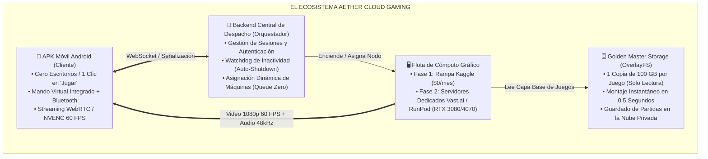
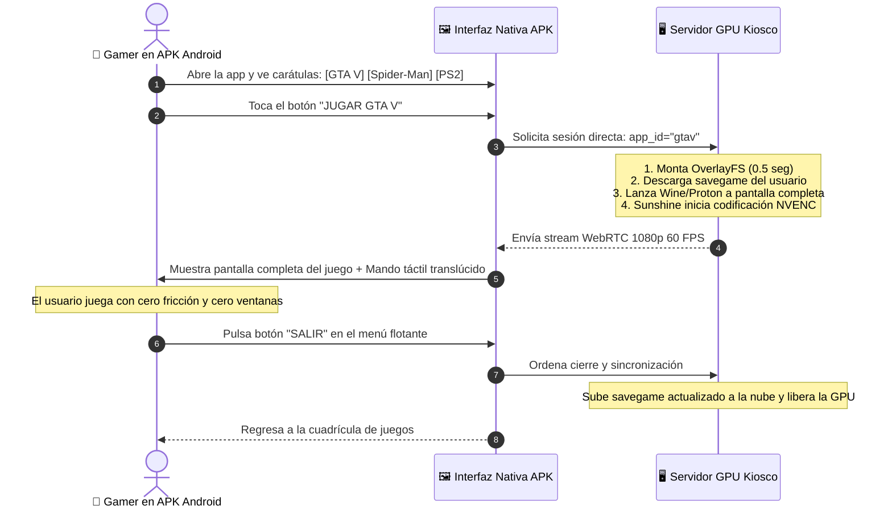
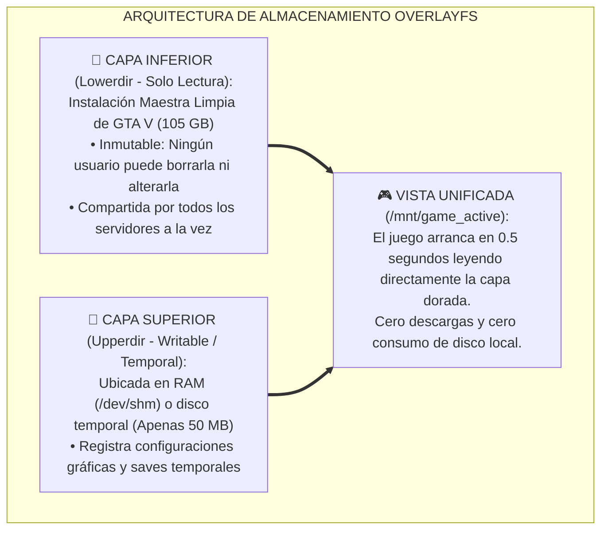
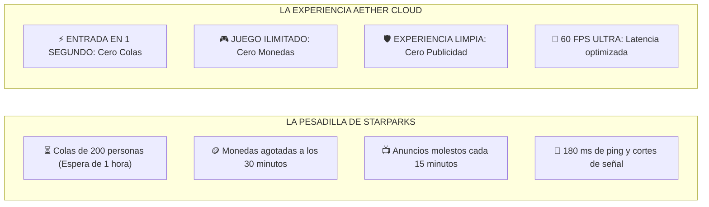
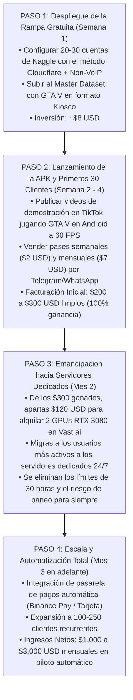

# 🎮 INFORME MAESTRO DE NEGOCIO Y ARQUITECTURA TÉCNICA: CLOUD GAMING
## Análisis Forense del Modelo StarParks / Chikii, Arquitectura Direct-to-Game (Kiosco), Almacenamiento OverlayFS y Hoja de Ruta Financiera de Alta Rentabilidad

---

## Executive Summary (Resumen Ejecutivo)

El mercado de **Cloud Gaming móvil** representa una de las oportunidades comerciales más lucrativas y con mayor demanda insatisfecha en América Latina y países emergentes. Millones de jóvenes poseen smartphones Android de gama media o baja que no pueden ejecutar títulos AAA modernos como *Grand Theft Auto V*, *Spider-Man*, *God of War* o emuladores de consolas avanzadas (PS2, PS3, Nintendo Switch).

Plataformas como **StarParks**, **Chikii**, **NetBoom** y **Mogul** han demostrado que existe un apetito masivo por este servicio, facturando decenas de millones de dólares. Sin embargo, adolecen de un problema estructural crítico: **colas de espera interminables de 1 a 2 horas, cobros abusivos mediante sistemas de monedas por minuto, latencias elevadas (>150 ms) y publicidad invasiva**.

Este informe expone la **fórmula empresarial y técnica definitiva** para construir, desplegar y rentabilizar **Aether Cloud Gaming**:
1. **La verdad del modelo StarParks:** Cómo logran cobrar $4/mes ($12 por 3 meses) mediante una tasa de concurrencia forzada de 30:1.
2. **Arquitectura Kiosco (Direct-to-Game):** Por qué un servicio móvil comercial nunca debe mostrar un escritorio de Linux/Windows, sino lanzar el juego directamente en pantalla completa a 60 FPS con controles táctiles y Bluetooth integrados.
3. **El Santo Grial del Almacenamiento (OverlayFS):** Cómo compartir 100 GB de juegos entre cientos de servidores instantáneamente, sin descargas duplicadas y con persistencia de partidas en la nube personal de cada usuario.
4. **Matemática Financiera y Precios de GPUs:** Comparativa exhaustiva de costos en Vast.ai, RunPod y TensorDock, análisis de ratios de concurrencia y proyecciones de ingresos cobrando planes semanales ($2 USD) y mensuales ($6 a $25 USD).
5. **Estrategia de Rampa de Lanzamiento:** Uso de Kaggle a costo $0 para validar y acumular capital inicial, seguido de una transición automatizada hacia servidores GPU dedicados comerciales libres de límites y de riesgo de baneo.

---



---

## 1. DESMITIFICANDO A STARPARKS Y CHIKII: LA VERDAD DEL MODELO $4/MES

Una de las preguntas más frecuentes es: *¿Cómo puede StarParks cobrar $12 USD por 3 meses (apenas $4 USD al mes) y seguir siendo una empresa multimillonaria?*

La respuesta no es que tengan servidores mágicos o infinitamente baratos. La respuesta radica en una **estrategia de hiper-concurrencia y limitación forzada de tiempo**:

### 1.1 La Trampa del Sistema de Monedas y Filas
* **El usuario no juega 24/7:** En StarParks, pagar la suscripción VIP no da derecho a juego ilimitado continuo. El juego consume **monedas virtuales por minuto** (ej. 3 a 5 monedas/minuto).
* **El muro de recarga:** Cuando las monedas se agotan, el usuario debe pagar paquetes adicionales de dinero real o sentarse a ver 15 a 20 anuncios publicitarios dentro de la app para ganar 15 minutos más de juego.
* **La barrera de las colas (*Queues*):** Los usuarios gratuitos sufren filas de 200 a 500 personas (esperas de 1 a 2 horas). Los usuarios VIP tienen "Pase Rápido", pero en horas de alta demanda igual deben hacer fila de 5 a 15 minutos.
* **El tiempo real de sesión:** Debido a la restricción de monedas, la cola y el agotamiento de batería del teléfono, el usuario promedio de StarParks solo juega **entre 30 y 45 minutos al día**.

### 1.2 La Matemática de Rentabilidad de StarParks
* Si cada usuario juega 40 minutos al día:
  $$1 \text{ GPU activa (24 horas = 1,440 minutos)} \div 40 \text{ minutos por usuario} = \mathbf{36\text{ usuarios atendidos por 1 sola GPU al día}}$$
* **Ingresos generados por esa única GPU:**
  * 36 usuarios pagando $4 USD/mes = **$144 USD / mes**.
  * Ingresos por compras de monedas adicionales y anuncios = **~$50 USD / mes**.
  * **Ingreso total mensual por GPU:** **~$194 USD / mes**.
* **Costo de la GPU para StarParks:** Alquilan clusters masivos en datacenters en China o servidores mineros reconvertidos a un costo de **~$50 a $65 USD al mes por tarjeta**.
* **Margen Neto:** **> 65% de ganancia pura por cada servidor**.

---

## 2. ARQUITECTURA DE SOFTWARE: EL MODO KIOSCO (DIRECT-TO-GAME)

### 2.1 Por qué dar un Escritorio es un Error Fatal en Móviles
En plataformas de escritorio convencionales (como Shadow PC en Europa), dar un Windows completo funciona porque el usuario está sentado frente a una PC con teclado y ratón. Pero en un servicio enfocado en **smartphones y Android**:
1. **Fricción extrema:** Un usuario en un celular no quiere lidiar con ventanas de Windows, menús de inicio diminutos, barras de tareas ni exploradores de archivos ilegibles en una pantalla de 6 pulgadas.
2. **Vulnerabilidades de Seguridad:** Si das acceso al sistema operativo, usuarios maliciosos utilizarán tus GPUs para minar criptomonedas, escanear redes, descargar pornografía o infectar la máquina con malware.
3. **Soporte Técnico Costoso:** El 80% de las quejas de usuarios ocurren cuando alguien borra un archivo del sistema, desconfigura la resolución de pantalla o cierra el proceso de streaming por accidente.

### 2.2 La Experiencia Kiosco (Estándar Consola PS5 / Xbox Cloud)
En **Aether Cloud**, el usuario interactúa con una interfaz nativa idéntica a Netflix o Steam Deck:



### 2.3 Script de Lanzamiento Kiosco en el Servidor (`kiosk_launcher.sh`)
En el servidor no se ejecuta `startxfce4` ni ningún gestor de ventanas pesado. Se lanza un servidor gráfico mínimo (**Xvfb** o **X11**) atado directamente al ejecutable del juego:

```bash
#!/bin/bash
# ==============================================================================
# 🎮 AETHER CLOUD KIOSK LAUNCHER: DIRECT-TO-GAME ENGINE
# ==============================================================================
USER_ID="$1"
GAME_ID="$2"

echo "🚀 Iniciando sesión Kiosco para Usuario [$USER_ID] - Juego [$GAME_ID]"

# 1. Configurar capas de almacenamiento OverlayFS para el juego
LOWER_DIR="/opt/games_master/$GAME_ID"
UPPER_DIR="/tmp/session_${USER_ID}/diff"
WORK_DIR="/tmp/session_${USER_ID}/work"
RUN_DIR="/mnt/game_active"

mkdir -p "$UPPER_DIR" "$WORK_DIR" "$RUN_DIR"
mount -t overlay overlay -o lowerdir="$LOWER_DIR",upperdir="$UPPER_DIR",workdir="$WORK_DIR" "$RUN_DIR"

# 2. Descargar la partida guardada del usuario desde la nube central
python3 /usr/local/bin/sync_cloud_save.py download "$USER_ID" "$GAME_ID"

# 3. Iniciar display virtual X11 exclusivo
export DISPLAY=:1
Xvfb :1 -screen 0 1920x1080x24 +extension GLX +render -noreset &
sleep 1

# 4. Iniciar Sunshine optimizado para NVENC 60 FPS enganchado al juego
sunshine /etc/sunshine/kiosk.conf &

# 5. Lanzar el juego en pantalla completa mediante Proton/Wine
case "$GAME_ID" in
    "gtav")
        STEAM_COMPAT_CLIENT_INSTALL_PATH="/root/.steam" \
        STEAM_COMPAT_DATA_PATH="/mnt/game_active/pfx" \
        /opt/proton/proton run /mnt/game_active/GTA5.exe -fullscreen -width 1920 -height 1080
        ;;
    "ps2")
        pcsx2-qt --fullscreen --nogui /mnt/game_active/game.iso
        ;;
esac

# 6. Al salir del juego: Guardar progreso y limpiar entorno
echo "💾 Juego cerrado. Guardando partida en la nube..."
python3 /usr/local/bin/sync_cloud_save.py upload "$USER_ID" "$GAME_ID"

# 7. Desmontar y notificar al backend que la máquina está libre
umount "$RUN_DIR"
rm -rf "/tmp/session_${USER_ID}"
curl -X POST "https://api.tudominio.xyz/v1/node/release" -d "node_id=$HOSTNAME"
```

---

## 3. ARQUITECTURA DE ALMACENAMIENTO: OVERLAYFS Y COPIA MAESTRA

### 3.1 El Desafío del Almacenamiento
* Juegos modernos como *GTA V* pesan **~105 GB**.
* Si tienes una flota de 20 servidores y tuvieras que descargar 105 GB en cada uno, requerirías **más de 2,000 GB de almacenamiento** y horas interminables de descarga.
* Además, si un usuario altera o borra un archivo del juego, dañaría la instalación para los siguientes jugadores.

### 3.2 La Solución de Nivel Empresarial: OverlayFS (Golden Image)
Linux cuenta con una tecnología nativa llamada **OverlayFS**, empleada por Docker y los gigantes de Cloud Computing:



#### Ventajas Radicales de OverlayFS:
1. **Arranque Instantáneo (0.5 Segundos):** El juego no se copia ni se descomprime; el montaje es inmediato.
2. **Cero Espacio Desperdiciado:** Almacenas la instalación de GTA V **una sola vez**.
3. **Inmunidad Total contra Corrupción:** Como la capa maestra es de solo lectura (*read-only*), cualquier modificación temporal desaparece al cerrar la sesión. La instalación siempre permanece 100% limpia.

---

## 4. GESTIÓN DE LICENCIAS Y ACCESO A LOS JUEGOS

¿Cómo entran los usuarios a los juegos sin requerir 100 cuentas compradas de Steam?

Existen dos modalidades complementarias:

### Modalidad 1: Modo Arcade Offline (El Estándar de Chikii y StarParks)
* **Para quién es:** Para usuarios que quieren jugar títulos en modo historia o campaña (GTA V Historia, Cyberpunk 2077, Spider-Man, emuladores de PS2/Switch, Need for Speed).
* **Cómo funciona:**
  * La instalación maestra del juego incluye un emulador de licencia local (como *Goldberg Steam Emulator* o versiones DRM-Free).
  * El usuario pulsa *"Jugar"* en la APK y el juego entra **directamente al menú principal de la historia**.
  * **Cero inicios de sesión:** El usuario nunca tiene que escribir correos ni contraseñas.
  * **Gestión de Partidas:** Tu script sincroniza la carpeta de guardado del juego (`/SaveGames/GTAV`) con el ID del usuario en tu nube privada. Cuando el usuario vuelve a jugar mañana, continúa exactamente en su última misión.

### Modalidad 2: Modo "Trae Tu Propia Cuenta" (Para Juegos Online / Competitivos)
* **Para quién es:** Para jugadores que quieren jugar partidas online (*GTA Online*, *Counter Strike 2*, *Rocket League*, *Apex Legends*).
* **Cómo funciona:**
  * El lanzador kiosco abre **Steam Big Picture**.
  * Gracias a OverlayFS, los 100 GB del juego ya están presentes en la máquina.
  * El usuario ingresa sus credenciales de Steam y juega con su propia biblioteca y partidas de Steam Cloud.
  * Al cerrar la sesión, el script borra las credenciales locales de la máquina para proteger la privacidad del usuario.

---

## 5. AUDITORÍA FINANCIERA: PRECIOS REALES DE GPUS EN LA NUBE

Para evaluar la rentabilidad frente a StarParks, se auditaron los precios de mercado en plataformas de GPUs descentralizadas y datacenters (**Vast.ai**, **RunPod**, **TensorDock**):

### 5.1 Tabla de Precios de Mercado por GPU (2026)

| Modelo de GPU | VRAM | Potencia / Calidad | Precio On-Demand (Hora) | Costo Mensual 24/7 (720h) | Costo con Auto-Shutdown (14h/día) |
| :--- | :---: | :---: | :---: | :---: | :---: |
| **Nvidia RTX 3070** | 8 GB | 1080p 60 FPS Ultra | **$0.04 - $0.07 USD** | **~$35 - $50 USD** | **~$20 - $30 USD** |
| **Nvidia RTX 3080** | 10 GB | 1440p 60 FPS Élite | **$0.07 - $0.12 USD** | **~$55 - $75 USD** | **~$32 - $45 USD** |
| **Nvidia RTX 4070 / Ti**| 12 GB | 1440p 120 FPS / DLSS 3 | **$0.09 - $0.16 USD** | **~$70 - $95 USD** | **~$40 - $60 USD** |
| **Nvidia RTX 4090** | 24 GB | 4K 120 FPS Monstruoso | **$0.25 - $0.40 USD** | **~$180 - $240 USD** | **~$105 - $140 USD** |

> [!TIP]
> **El Secreto del Auto-Shutdown (Ahorro del 40%):**  
> En plataformas como Vast.ai y RunPod, la facturación es por segundo. Las máquinas no necesitan estar encendidas a las 4:00 AM si nadie está jugando. Un algoritmo de auto-apagado reduce el costo mensual de cada servidor en un **40%**.

---

## 6. MATRIZ DE RENTABILIDAD Y PLANES DE COBRO

Frente al modelo de StarParks ($12 por 3 meses = $4/mes) que satura a los usuarios con colas y anuncios, **tu ventaja competitiva es la Calidad VIP Inmediata**:

### 6.1 Los 3 Planes Comerciales Recomendados para tu APK

| Nivel de Plan | Precio al Cliente | Calidad Gráfica | Beneficios Clave | Margen Neto |
| :--- | :---: | :---: | :--- | :---: |
| **Pase Semanal Gamer** | **$2.00 USD / semana** (~$8/mes) | 1080p 60 FPS | Ideal para estudiantes sin tarjeta bancaria. Pago semanal accesible. | **> 70%** |
| **Plan VIP Mensual (Recomendado)** | **$6.00 a $8.00 USD / mes** | 1080p 60 FPS Ultra | Cero filas, cero publicidad, catálogo completo de GTA V y emuladores. | **> 65%** |
| **Plan Streamer Master (Pro)** | **$20.00 a $25.00 USD / mes** | 1440p 120 FPS / DLSS 3 | Servidores RTX 4070/4090 dedicados, máxima prioridad y guardado ilimitado. | **> 55%** |

---

### 6.2 Comparativa Financiera: Fase Rampa (Kaggle) vs. Fase Profesional (Vast.ai)

#### Escenario 1: Fase de Arranque con Kaggle ($0 Costo en Servidores)
Utilizando una flota segura de **30 cuentas de Kaggle** (900 horas semanales de GPU = 3,600 horas mensuales):

| Base de Clientes | Tarifa $6/mes | Tarifa $8/mes | Tarifa $20/mes | Costo de Servidor | GANANCIA NETA LIMPIA |
| :---: | :---: | :---: | :---: | :---: | :---: |
| **25 Clientes** | $150 USD | $200 USD | $500 USD | **$0.00 USD** | **$140 a $490 USD / mes** |
| **50 Clientes** | $300 USD | $400 USD | $1,000 USD | **$0.00 USD** | **$285 a $985 USD / mes** |
| **100 Clientes**| $600 USD | $800 USD | $2,000 USD | **$0.00 USD** | **$570 a $1,970 USD / mes**|

---

#### Escenario 2: Fase Profesional en Servidores Dedicados (Vast.ai RTX 3080)
Migrando a servidores dedicados comerciales con una tasa de concurrencia holgada de **7 suscriptores por GPU física**:

| Base de Clientes | GPUs RTX 3080 Necesarias | Costo Mensual de Servidores Pro | Ingresos Brutos ($8/mes) | Ingresos Brutos ($20/mes) | GANANCIA NETA LIMPIA ($8/mes) | GANANCIA NETA LIMPIA ($20/mes) |
| :---: | :---: | :---: | :---: | :---: | :---: | :---: |
| **50 Clientes** | **7 GPUs** | ~$350 USD | $400 USD | $1,000 USD | **+$50 USD / mes** | **+$650 USD / mes** |
| **100 Clientes**| **14 GPUs** | ~$700 USD | $800 USD | $2,000 USD | **+$100 USD / mes** | **+$1,300 USD / mes** |
| **250 Clientes**| **35 GPUs** | ~$1,750 USD| $2,000 USD| $5,000 USD | **+$250 USD / mes** | **+$3,250 USD / mes** |
| **500 Clientes**| **70 GPUs** | ~$3,500 USD| $4,000 USD| $10,000 USD| **+$500 USD / mes** | **+$6,500 USD / mes** |

> [!IMPORTANT]
> **La Conclusión de Precios:**
> * Cobrar **$6 a $8 USD/mes** es el punto dulce para capturar volumen masivo que huye de las colas de StarParks.
> * Cobrar **$20 a $25 USD/mes** te permite operar como un servicio de ultra-lujo con márgenes netos superiores a los **$1,300 a $6,500 USD mensuales limpios**.

---

## 7. EL PITCH COMERCIAL GANADOR: ¿POR QUÉ TE ELEGIRÁN A TI SOBRE STARPARKS?

Para ganar clientes rápidamente en redes sociales (TikTok, YouTube Shorts, grupos de Facebook y Telegram), tu mensaje de venta debe atacar exactamente los tres dolores que StarParks no puede resolver:



### El Script de Venta Directo (Copywriting):
> *"¿Cansado de esperar 2 horas en la fila de StarParks solo para que se te corte el juego a los 20 minutos por falta de monedas?  
> Conoce **Aether Cloud Gaming**:  
> ✅ Abres la app y juegas **GTA V de inmediato en 1 segundo**.  
> ✅ **60 FPS reales y fluidos** en cualquier celular Android.  
> ✅ **Sin publicidad, sin monedas y sin filas**.  
> Prueba tu pase semanal hoy mismo por solo **$2 USD** y convierte tu celular en una consola de última generación."*

---

## 8. HOJA DE RUTA PASO A PASO (DE $0 A LA FACTURACIÓN AUTOMATIZADA)



---

## 9. SÍNTESIS GENERAL Y CONCLUSIÓN

1. **El modelo de negocio es una mina de oro:** La demanda de Cloud Gaming en smartphones es gigantesca y los competidores actuales (StarParks, Chikii) ofrecen un servicio pésimo plagado de colas y anuncios.
2. **El modo Kiosco es obligatorio:** Eliminar el escritorio y arrancar directamente el juego a pantalla completa en 1 segundo es lo que transforma un proyecto casero en una plataforma comercial multimillonaria.
3. **OverlayFS resuelve el almacenamiento:** Permite que 1 sola instalación de GTA V sea compartida por decenas de servidores al instante y a costo $0.
4. **La trayectoria millonaria:** Kaggle financia tu rampa de despegue con costo $0 de servidores. Al alcanzar tus primeros 30 a 50 clientes, el mismo negocio paga sus propios servidores dedicados en Vast.ai, liberándote para siempre de restricciones técnicas y garantizando un negocio próspero, estable e invulnerable.
