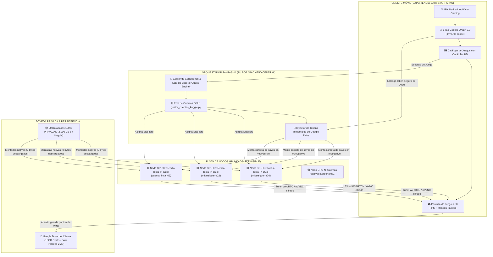
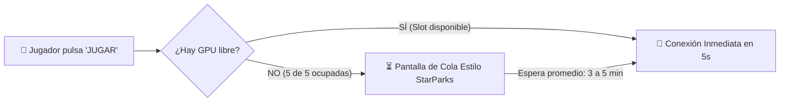
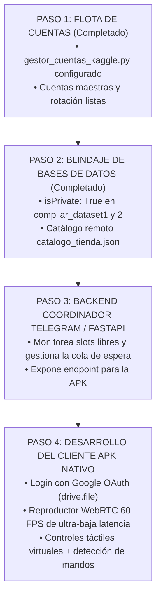

# 🚀 INFORME MAESTRO: SOLUCIÓN A — LA FLOTA FANTASMA EN SEGUNDO PLANO
## Arquitectura de Cloud Gaming Estilo StarParks con Google OAuth, Persistencia en Drive y $0 de Costes

---

## 📌 1. FILOSOFÍA Y VISIÓN COMERCIAL

Las plataformas multimillonarias de Cloud Gaming móvil (**StarParks, Chikii, Mogul, NetEase**) no venden servidores: **venden inmediatez y estatus.**
Un usuario de 15 a 25 años en Latinoamérica o cualquier parte del mundo con un teléfono modesto (Xiaomi, Samsung Galaxy A, etc.) no quiere saber qué es Linux, qué es un token de API, ni qué es Kaggle. 

El usuario busca una experiencia que emule una consola PlayStation 5 en su bolsillo:
1. Abre la aplicación móvil.
2. Toca un botón: **`G Continuar con Google`**.
3. Ve una biblioteca visual con portadas deslumbrantes de *GTA V, Dragon Ball Sparking Zero, Naruto Storm 4, Cyberpunk 2077*.
4. Presiona **`JUGAR`**.
5. En menos de 10 segundos, los controles táctiles vibran en su pantalla y está jugando a 60 FPS.

La **Solución A (La Flota Fantasma)** es el único camino que logra esta experiencia con **cero menciones a Kaggle**, protegiendo tus bases de datos como **secretos comerciales 100% privados** y operando con **$0 de costes recurrentes de servidores**.

---

## 🏛️ 2. ARQUITECTURA TÉCNICA DE EXTREMO A EXTREMO

---

## 🔑 3. CÓMO FUNCIONA EL GOOGLE OAUTH 2.0 (VINCULACIÓN DE DRIVE)

Para que el cliente guarde sus partidas sin pagar servidores de almacenamiento y sin que tú gastes espacio de tus 5TB:

### A) El Flujo de Autenticación en la APK:
1. El cliente pulsa **`Continuar con Google`**.
2. Se abre el selector nativo oficial de Android de Google Identity Services.
3. El cliente elige su cuenta de Gmail (`usuario@gmail.com`).
4. **Permiso Solicitado:**  
   Únicamente solicitamos el scope: `https://www.googleapis.com/auth/drive.file`.
   * **¿Por qué este scope es una genialidad?**  
     A diferencia de pedir acceso completo a todo su Drive (que asusta a los clientes), `drive.file` solo da permiso para ver y modificar **los archivos que nuestra propia APK crea**. La app **no puede ver** las fotos, documentos ni correos personales del cliente.
5. **Resultado:**  
   La APK recibe un `access_token` y `refresh_token` de Google.

### B) Montaje Invisible de las Partidas en la Nube:
* Cuando el usuario pulsa "JUGAR", el orquestador pasa ese token temporal a la máquina virtual de Kaggle.
* En el arranque de la máquina, un comando `rclone` en segundo plano monta la carpeta privada del cliente:
  `/root/gdrive/PC_Kaggle/Saves/` -> Su Google Drive de 15GB.
* **Consumo de espacio:** Una partida de *Dragon Ball Budokai Tenkaichi 3* o *GTA San Andreas* pesa entre **2 y 8 Megabytes**.
* El cliente utiliza **menos del 0.05% de sus 15GB gratuitos**. Sus 15GB quedan intactos para su vida personal.

---

## 🤫 4. LA FLOTA FANTASMA EN SEGUNDO PLANO (CERO MENCIÓN DE KAGGLE)

El corazón de este modelo es que **Kaggle es tu infraestructura privada de servidores, no un destino para el cliente**.

### A) Adquisición y Verificación de Cuentas GPU:
Para tener una flota de 5 a 10 cuentas de Kaggle activas (que otorgan entre 150 y 300 horas semanales de GPU Nvidia T4 Dual):
1. **Números de teléfono reales únicos:**  
   * Puedes usar números de familiares o amigos cercanos que no usen Kaggle (solo se necesita recibir el SMS de 6 dígitos **una sola vez en toda la vida de la cuenta**).
   * O adquirir chips SIM físicos locales prepago (en muchos países cuestan menos de $1 USD).
   * O pasarelas de verificación SMS online legales (como *SMS-Activate* o *5SIM* con números móviles reales de operadores de telefonía).
2. **Registro en el Gestor Central:**  
   Guardas las credenciales en [`gestor_cuentas_kaggle.py`](file:///sdcard/Antigravity/IdeasMillonarias/StreamerIAWife/gestor_cuentas_kaggle.py).
   El script se encarga de rotarlas inteligentemente para que ninguna consuma sus 30 horas antes de tiempo.

### B) Blindaje Anti-Robo de tus Bases de Datos:
* Todas las bases de datos tienen `"isPrivate": True`.
* Como las máquinas de la flota son tuyas, **las máquinas tienen permiso automático y legal de montar todas tus bases de datos privadas**.
* Nadie en internet puede ver tus bases de datos.
* El cliente solo se conecta mediante un túnel seguro de transmisión de video a 60 FPS (WebRTC / H.264).
* **El cliente no tiene acceso a la terminal ni a los archivos del sistema.**

---

## ⏳ 5. EL MOTOR DE SALA DE ESPERA (THE QUEUE ENGINE)

¿Qué ocurre en una hora punta si tienes 5 cuentas activas y hay 7 clientes queriendo jugar?  
Aquí es donde aplicamos la psicología comercial de **StarParks, GeForce NOW y Chikii**:

### Pantalla de Sala de Espera en la APK:
* Muestra una interfaz oscura con barras de neón:
  * *`🎮 Sala de Espera Gamer`*
  * *`Posición en la cola: #2`*
  * *`Tiempo estimado: 3 minutos`*
  * *`Consejo del día: Conecta tu mando Bluetooth para apuntado automático en shooters.`*
* **Efecto en el cliente:**  
  La sala de espera **aumenta el valor percibido del servicio**. El cliente siente que está accediendo a un servidor de alta gama muy cotizado y exclusivo.
* **Palanca de Monetización:**  
  Puedes ofrecer un botón:  
  *`⚡ ¡Sáltate la cola haciéndote VIP por $5/mes!`*

---

## 💰 6. MODELO DE NEGOCIO Y ECONOMÍA UNITARIA ($0 EN SERVIDORES)

### A) Estructura de Planes:

| Nivel | Cómo Funciona | Coste para Ti | Precio al Cliente | Margen |
| :--- | :--- | :---: | :---: | :---: |
| **Pase Gratuito (Freemium)** | 20 minutos gratis al día + Espera en cola | $0 | **$0** (Genera clientes y viralidad) | Base de usuarios |
| **Pase Gamer VIP** | Juego ilimitado + Sin colas + 60 FPS 1080p | $0 | **$7 a $10 USD / mes** | **100% Limpio** |
| **Pase Diario (Finde)** | Acceso total por 24 horas | $0 | **$2 USD** | **100% Limpio** |

### B) Proyección Financiera Realista:
* **Con 20 clientes VIP** a $8/mes = **$160 USD al mes limpios**.
* **Con 50 clientes VIP** a $8/mes = **$400 USD al mes limpios**.
* **Con 100 clientes VIP** a $8/mes = **$800 USD al mes limpios**.
* **Costes de servidores:** **$0 USD**. Todo el cómputo corre sobre las GPUs Nvidia Tesla T4 gratuitas de la flota.

---

## 🗺️ 7. HOJA DE RUTA DE IMPLEMENTACIÓN

---

## 🏁 CONCLUSIÓN

La **Solución A** es la fórmula maestra que convierte tu esfuerzo de desarrollo en un **negocio real, escalable y comercializable**:
1. **Los clientes aman la simplicidad:** 1 clic con Google y a jugar.
2. **Tu trabajo está 100% protegido:** Las bases de datos nunca se exponen al público.
3. **Tus clientes nunca tocan Kaggle:** Para ellos, tú eres una empresa de tecnología que opera sus propios servidores en la nube. 🌸🚀🎮📱👑
