# 🎬 GUÍA MAESTRA: LINUWAIFU CLOUD STUDIO VTUBER (KAGGLE DUAL-GPU T4 + KICK)
### ⚡ Motor Maestro 1-Click All-in-One: Sincronización Automática con GitHub + Smart Caching + Dual-GPU T4x2 + Túnel Cloudflare Integrado

---

## 📌 PASO 1: Opciones del Notebook en Kaggle (Barra Lateral Derecha)
En la barra lateral derecha de tu Notebook en Kaggle:
* **Accelerator**: Selecciona `GPU T4 x2`
* **Internet**: Actívalo en `Internet on` *(Obligatorio)*

---

## 🔑 CLAVES SSH PARA GITHUB (CANAIMA Y CELULAR)
Para conectar tu repositorio privado de GitHub y clonar/guardar sin contraseñas en [github.com/settings/ssh/new](https://github.com/settings/ssh/new):

### 💻 Canaima:
```text
ssh-ed25519 AAAAC3NzaC1lZDI1NTE5AAAAIOO3iL5THfGYnCvBMIuJtR2rEcwxR85bQn5SAuQGLBWu miguel@Miguel
```

### 📱 Celular:
```text
ssh-ed25519 AAAAC3NzaC1lZDI1NTE5AAAAIFcxCzZIe/GQsCN/85OAo2kVAl2FLhDFSL0S5exfQIat u0_a231@localhost
```

---

## 🚀 CELDA ÚNICA MAESTRA (1-CLICK ALL-IN-ONE):

> [!TIP]
> **¡Solo necesitas esta única celda en todo tu Notebook de Kaggle!**
> Al darle Play, descarga tus cambios de GitHub en 3 segundos, comprueba qué dependencias ya están instaladas para no repetir nada, y levanta todo el estudio en vivo con tu URL de Cloudflare directa.

```python
# ==============================================================================
# 🌸 LINUWAIFU CLOUD STUDIO PRO - ARRANQUE MAESTRO 1-CLICK ALL-IN-ONE
# ==============================================================================
!git clone https://github.com/miguelguerra200022-sudo/StreamerIAWife.git /kaggle/working/StreamerIAWife 2>/dev/null || (cd /kaggle/working/StreamerIAWife && git reset --hard origin/main && git pull origin main)
%cd /kaggle/working/StreamerIAWife
!python3 run_kaggle_all_in_one.py
```

---

## 💾 CELDA DE RESPALDO (CUANDO TERMINES TU STREAM O QUIERAS GUARDAR MEMORIA):

Si quieres sincronizar los nuevos recuerdos aprendidos de la base de datos de vuelta a GitHub:

```python
# ==============================================================================
# 💾 GUARDAR MEMORIA Y AJUSTES DE VUELTA A GITHUB (1-CLICK BACKUP)
# ==============================================================================
!cd /kaggle/working/StreamerIAWife && git add streamer_memory.db 2>/dev/null && git commit -m "Auto-backup memoria stream" 2>/dev/null && git push origin main 2>/dev/null || echo "Memoria al día."
```

---

## 🎮 CÓMO FUNCIONA EL FLUJO DE TRABAJO PERFECTO:

```mermaid
graph LR
    subgraph CANAIMA["💻 Tu Canaima (Estación de Desarrollo)"]
        Dev["Editas código / avatares"]
        Antigravity["Antigravity sube cambios a GitHub con 1 comando"]
    end

    subgraph GITHUB["☁️ GitHub Privado (StreamerIAWife)"]
        Repo["Repositorio Maestro Actualizado"]
    end

    subgraph KAGGLE["⚡ Kaggle Dual-GPU T4 x2 (1-Click Start)"]
        KaggleRun["Le das Play a la Celda Única"]
        SmartCheck["Smart Caching: No reinstala nada si ya existe"]
        Studio["FastAPI + Cerebro + Kokoro + Kick + Túnel Cloudflare"]
    end

    subgraph CELULAR["📱 Tu Celular (Estudio Remoto Pro)"]
        Panel["Abres el link https://xxxx.trycloudflare.com/static/studio.html<br/>Control táctil laptop, audio modulado y stream en vivo"]
    end

    Dev --> Antigravity
    Antigravity -->|git push| Repo
    Repo -->|git pull automático al dar Play| KaggleRun
    KaggleRun --> SmartCheck
    SmartCheck --> Studio
    Studio -->|1 solo salto sin pasar por tu casa| Panel
```


