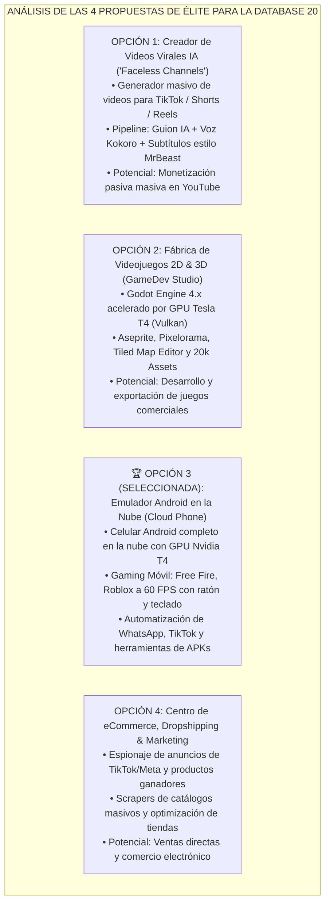

# 📱 INFORME ESTRATÉGICO: LAS 4 ALTERNATIVAS DE ÉLITE PARA LA DATABASE 20 Y ELECCIÓN OFICIAL DE "ANDROID CLOUD PHONE"

---

## 📌 RESUMEN EJECUTIVO
Este informe documenta la re-evaluación estratégica de la **Database 20** para el ecosistema de Ubuntu Cloud PC. Tras un análisis riguroso de arquitectura en la nube, se determinó que la idea original de herramientas de rescate físico (como *GParted* o *TestDisk*) carece de utilidad real en un entorno de contenedores efímeros como Kaggle (donde no existen discos duros físicos que particionar ni sectores que rescatar, y donde todo dato vital ya se persiste en 5TB de Google Drive).

A continuación se detallan las **4 alternativas de máximo valor comercial analizadas** y la **elección oficial del usuario: convertir la Database 20 en una Superestación de Emulación Android en la Nube (Cloud Phone Hub)**.

---

## 1. 🔍 LAS 4 ALTERNATIVAS DE ALTO VALOR ANALIZADAS

---

## 2. 📱 LA ELECCIÓN OFICIAL: DATABASE 20 = `Ubuntu - Emulador Android en la Nube & Mobile Hub`

### ¿Por qué esta opción es la más potente para coronar las 20 Databases?
1. **Mercado de "Cloud Phones" Multimillonario:** Servicios como Redfinger, LDCloud o BlueStacks Cloud cobran altas mensualidades por darte un celular virtual lento en la nube. Esta Database te da un **teléfono Android ultra-potente con 32 GB de RAM y GPU Nvidia Tesla T4 gratis**.
2. **Cero consumo de batería ni espacio en tu celular físico:** Puedes correr juegos pesados, bots de redes sociales o descargas de apps Android dentro de la nube de Google sin desgastar tu teléfono móvil.
3. **Gaming Móvil a 60 FPS:** Jugar títulos móviles competitivos con ratón y teclado completamente mapeados desde la pantalla del navegador.

---

## 3. 🛠️ ESPECIFICACIONES TÉCNICAS DE LA DATABASE 20 (PLAN DE CONSTRUCCIÓN)

* **Nombre Oficial:** `Ubuntu - Android Cloud Phone & Mobile Hub 100GB`
* **Slug Oficial en Kaggle:** `ubuntu-android-cloud-phone`
* **Capacidad:** 100 GB

### Módulos y Herramientas que se Integrarán:
1. **Entorno Android Virtual de Alta Eficiencia:**
   - Contenedor Android nativo con soporte de gráficos por hardware (OpenGL ES / Vulkan mediante Tesla T4).
   - Servidor **Scrcpy & ADB (Android Debug Bridge)** integrado para control de pantalla ultra-fluido a baja latencia.
2. **Tiendas y Servicios de Aplicaciones:**
   - **Aurora Store:** Cliente oficial y anónimo de Google Play Store para descargar cualquier APK directamente.
   - **F-Droid:** La tienda libre con miles de aplicaciones de código abierto sin rastreadores.
   - Soporte para MicroG (servicios de Google ligeros).
3. **Gaming Móvil & Mapeo de Controles:**
   - Pre-instalación de optimizaciones para **Free Fire, Roblox, Clash Royale, Brawl Stars y Genshin Impact Mobile**.
   - Mapeo de teclas (*Keymapping*) para jugar shooters con teclado y apuntado de ratón nativo.
4. **Automatización Móvil en Segundo Plano:**
   - Soporte para bots de automatización de tareas en Android (AutoClicker Pro, scripts de farmeo y macros continuas).
   - Instancia de WhatsApp Web / Telegram Móvil / TikTok Móvil para gestión de múltiples cuentas.
5. **Laboratorio de Ingeniería Inversa & APK Modding:**
   - **JADX GUI:** Descompilador visual de archivos `.apk` y `.dex` a código Java legible.
   - **APKTool:** Extractor y reempaquetador de recursos, manifiestos y assets de juegos móviles.
   - **Bytecode Viewer:** Analizador profundo de seguridad de aplicaciones Android.
6. **Agente Copiloto de IA Móvil (`ai_android_copilot.py`):**
   - Conectado a la Database 11 (Ollama Dual-GPU).
   - Modos: Creador de macros de juego, Auditor de permisos sospechosos en APKs, y Asistente de desarrollo de apps en Kotlin/Flutter.
7. **Persistencia Total en 5TB Google Drive:**
   - Ruta permanente: `/root/gdrive/PC_Kaggle/Android_Cloud_Phone/`:
     - `APKs_Instalados/`
     - `Datos_Juegos_OBB/`
     - `Backups_WhatsApp_Media/`
     - `Proyectos_APK_Decompiled/`

---

## 4. 🏁 ESTADO DEL PROYECTO HISTÓRICO
- **Databases 1 a 19:** Completamente diseñadas, estructuradas, verificadas y sincronizadas.
- **Database 20:** Planificada y aprobada como `Ubuntu - Android Cloud Phone`.
- **Próximo Paso:** Cuando el usuario envíe la palabra **`Listo`**, se procederá a codificar el compilador `compilar_dataset20_android_cloud_phone.py`, actualizar `run_kaggle_vnc_studio.py` y cerrar el informe maestro con las **20 de 20 Databases listas**.

---
*Informe estratégico archivado en el sistema local y almacenamiento raíz del dispositivo.*
