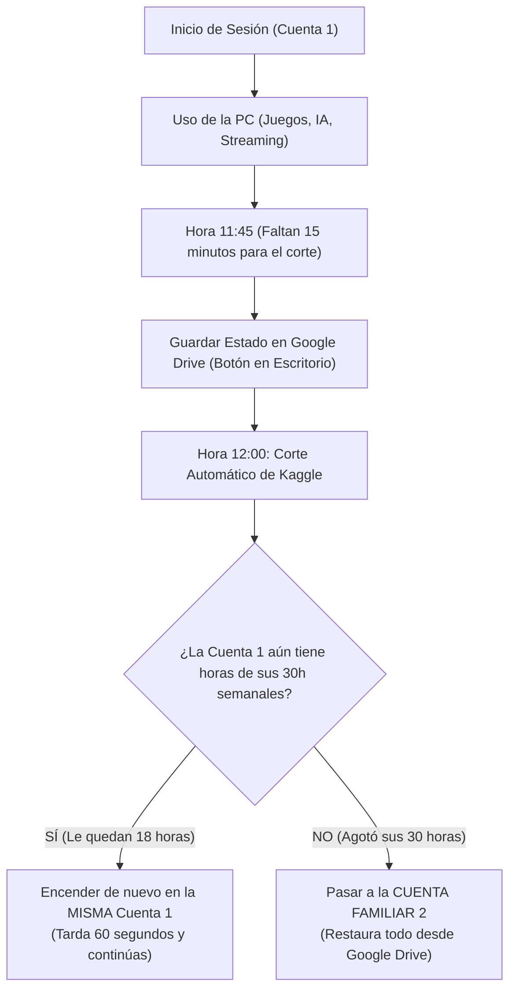

# 📊 PLANIFICACIÓN MATEMÁTICA Y OPERATIVA DE HORAS GPU: CÓMO CUBRIR 24/7 DE VIERNES A VIERNES
## Estrategia de Rotación Manual con Cuentas Familiares y Persistencia en Google Drive (5TB)

---

## 📌 OBJETIVO DEL INFORME
Este documento detalla el **cálculo matemático exacto**, el **cronograma de relevo semanal** y el **protocolo operativo** para mantener una estación de Ubuntu Cloud PC con GPU Nvidia Tesla T4 activa de forma continua de viernes a viernes, gestionando las cuotas de 30 horas semanales y los reinicios automáticos de 12 horas sin perder ningún progreso.

---

## 1. 🧮 LA MATEMÁTICA EXACTA DE LAS HORAS SEMANALES

En Kaggle, la cuota semanal de GPU se reinicia todos los **viernes por la noche (horario UTC)**. Una semana completa tiene:
$$\text{7 días} \times \text{24 horas} = \mathbf{168\text{ horas totales}}$$

Cada cuenta familiar verificada por número de teléfono aporta **30 horas semanales de GPU**.

### Tabla de Requerimientos según tu Nivel de Uso:

| Nivel de Uso Deseado | Horas Necesarias por Semana | Cálculo de Cuentas | Cuentas Familiares Requeridas | Horas Totales Disponibles | Margen de Sobra |
| :--- | :---: | :---: | :---: | :---: | :---: |
| **🎮 Modo Gamer / Streamer (8h / día)** | 56 horas | $56 / 30 = 1.86$ | **2 Cuentas** | 60 horas | +4 horas libres |
| **⚡ Modo Intensivo / Full Day (16h / día)** | 112 horas | $112 / 30 = 3.73$ | **4 Cuentas** | 120 horas | +8 horas libres |
| **🚀 Modo Continuo 24/7 (Sin descanso)** | 168 horas | $168 / 30 = 5.60$ | **6 Cuentas** | 180 horas | +12 horas libres |

> **Conclusión directa:**
> - Con **4 cuentas familiares** cubres **16 horas diarias todos los días de la semana** (desde que te levantas hasta que te duermes).
> - Con **6 cuentas familiares** cubres **24 horas al día los 7 días de la semana de forma ininterrumpida**.

---

## 2. ⏱️ LA MECÁNICA DE DESCONEXIÓN DE LAS 12 HORAS (CÓMO MANEJARLA)

Kaggle impone un límite de **12 horas continuas por sesión activa**. Esto no significa que se te acabe la cuota semanal, sino que el servidor se reinicia para liberar recursos.

### Protocolo de Reinicio en la Misma Cuenta:
- Cada cuenta rinde para **dos sesiones completas de 12 horas + una sesión corta de 6 horas** ($12 + 12 + 6 = 30$ horas).
- Cuando se cumplan las primeras 12 horas en la Cuenta 1:
  1. El sistema se apaga.
  2. Vuelves a presionar **"Run All" en esa misma cuenta**.
  3. En 60 segundos el escritorio vuelve a estar arriba y continúas usando la Cuenta 1 por otras 12 horas.
- Solo cuando se agoten las 30 horas completas de la Cuenta 1, pasas a la Cuenta 2.

---

## 3. 📅 CRONOGRAMA SEMANAL RECOMENDADO (DE VIERNES A VIERNES)

### Opción A: Plan de 4 Cuentas (Uso Intensivo de 16 horas diarias)

| Día de la Semana | Horas de Uso | Cuenta Asignada | Horas Consumidas de la Cuenta |
| :--- | :---: | :---: | :---: |
| **Viernes (Noche - Reset)** | 8h | **Cuenta 1** | 8h / 30h |
| **Sábado** | 16h | **Cuenta 1** | 24h / 30h |
| **Domingo** | 16h | **Cuenta 1 (6h) + Cuenta 2 (10h)** | Cuenta 1 Agotada (30h) / Cuenta 2 (10h) |
| **Lunes** | 16h | **Cuenta 2** | Cuenta 2 (26h / 30h) |
| **Martes** | 16h | **Cuenta 2 (4h) + Cuenta 3 (12h)** | Cuenta 2 Agotada (30h) / Cuenta 3 (12h) |
| **Miércoles** | 16h | **Cuenta 3** | Cuenta 3 (28h / 30h) |
| **Jueves** | 16h | **Cuenta 3 (2h) + Cuenta 4 (14h)** | Cuenta 3 Agotada (30h) / Cuenta 4 (14h) |
| **Viernes (Hasta la noche)** | 16h | **Cuenta 4** | Cuenta 4 (30h) -> **¡Llega el Reset Semanal!** |

---

## 4. 🔄 PASO A PASO: CÓMO CAMBIAR DE CUENTA SIN PERDER NINGÚN DATO

Para que la transición entre cuentas sea limpia y tu progreso de juegos, código o configuraciones no sufra ninguna pérdida:

1. **Antes de apagar la cuenta activa:**
   - Hacer clic en el icono del escritorio: `💾 Guardar Estado de mi PC` (o dejar que el auto-guardado de los 5 minutos lo haga).
   - Esto sube el archivo `ubuntu_user_state.tar.gz` a `gdrive:PC_Kaggle/system_state/`.
2. **Cerrar sesión de la cuenta que agotó cuota:**
   - Detener la libreta en Kaggle.
3. **Iniciar la siguiente cuenta familiar:**
   - Abrir la libreta en la nueva cuenta.
   - Presionar **"Run All"**.
4. **La magia de la sincronización:**
   - Como la nueva libreta tiene las mismas credenciales de Google Drive (`rclone.conf`), detecta el respaldo en tu carpeta `PC_Kaggle/`.
   - Restaura el portapapeles, las partidas de los emuladores, los proyectos de Blender y las pestañas.
   - En **2 minutos** estás trabajando exactamente donde lo dejaste.

---

## 5. 💡 RECOMENDACIONES PARA MAXIMIZAR LAS HORAS

1. **Apagar la máquina si no se está usando:**  
   Si vas a salir a comer o a descansar 2 horas, detén la sesión en Kaggle. Esas 2 horas no consumidas se acumulan para el fin de semana.
2. **Compartir las Databases con las cuentas familiares (Modo Colaborador):**  
   En tu cuenta principal (`miguelguerra26`), comparte tus Databases de 100GB con los nombres de usuario de tus otras cuentas en modo **Viewer**. Así ninguna cuenta tiene que volver a subir ni crear las databases.
3. **Usar acelerador CPU para descargas si no requieres GPU:**  
   Si vas a descargar archivos grandes por Chrome a Google Drive sin jugar, puedes iniciar la máquina en modo **CPU (que es ilimitada y no consume las 30 horas de GPU)**.

---
*Informe técnico y cronograma archivado en el sistema local y almacenamiento raíz del dispositivo.*
