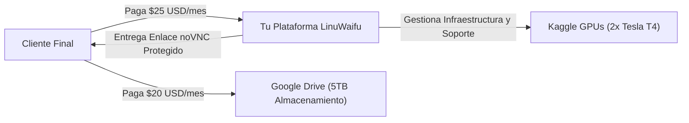
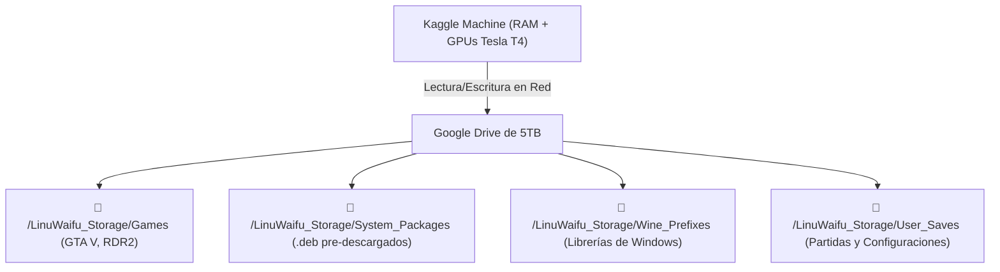

# 💼 PLAN DE NEGOCIO MAESTRO: LINUWAIFU CLOUD PC & AI VTUBER STUDIO

## 🎯 1. Resumen Ejecutivo (Executive Summary)
**LinuWaifu Cloud PC** es una plataforma privada de **Computación en la Nube y VTuber IA como Servicio (PaaS/SaaS)** que permite a cualquier persona jugar videojuegos de alta gama (GTA V, Red Dead Redemption 2, etc.) y transmitir en vivo con una streamer virtual inteligente (3D VTuber) desde su teléfono celular o laptop de bajos recursos, utilizando servidores GPU en la nube con almacenamiento infinito de 5TB.

* **Propósito**: Democratizar el acceso a PCs Gamer de alta gama ($1,500+ USD) y herramientas de streaming profesional por una fracción de su costo.
* **Ventaja Competitiva**: Algoritmo propietario protegido en GitHub (el cliente nunca ve el código), integración con 5TB de Google Drive y Avatar IA reactivo en tiempo real.

---

## 🌍 2. Oportunidad de Mercado y Público Objetivo

### A. El Problema del Mercado
1. **Barrera de Hardware**: En América Latina y España, más del 75% de los jóvenes no pueden comprar una PC Gamer con tarjeta gráfica NVIDIA moderna debido a los altos precios ($1,000 - $2,500 USD).
2. **Servicios de Cloud Gaming tradicionales limitados**: Servicios como *GeForce NOW* o *Xbox Cloud* tienen colas de espera, catálogos de juegos cerrados, no permiten instalar mods ni emuladores y no permiten hacer streaming profesional.

### B. El Cliente Ideal (Target Audience)
1. **Gamers Móviles y de PC básica**: Quieren jugar GTA V, RDR2, emuladores de PS2/PS3/Switch en Full HD 60 FPS desde su celular o laptop modesta.
2. **Creadores de Contenido y Streamers**: Quieren iniciar en Twitch/Kick/YouTube con un avatar IA que interactúe con el chat sin tener que comprar cámaras especiales ni PCs de dos monitores.

---

## 💎 3. Modelo de Negocio y Estructura de Precios

El modelo se basa en **Suscripción Mensual Recurrente (MRR)**. El cliente paga su almacenamiento de Google Drive ($20/mes directamente a Google) y te paga a ti por el servicio de Cloud PC gestionado:

### 🏷️ Planes de Suscripción:

| Plan | Precio Mensual | Qué Incluye |
| :--- | :--- | :--- |
| **🎮 Cloud Gamer Basic** | **$15 USD / mes** | Acceso a PC Ubuntu 1080p, 2x GPUs Tesla T4, conexión con su Google Drive de 5TB, modo Touchpad en celular y soporte. |
| **🌟 Streamer Pro Edition** | **$25 USD / mes** | Todo lo anterior + Suite de herramientas de streaming, audio virtual configurado, navegador y juegos preconfigurados. |
| **🌸 AI VTuber Studio VIP** | **$39 USD / mes** | Todo lo anterior + **LinuWaifu Avatar 3D VRM personalizado**, cerebro de Inteligencia Artificial (Llama 70B / Gemini), voz natural Edge-TTS y conexión automática con su chat de Twitch/Kick. |

---

## 🛡️ 4. Protección del Código y Propiedad Intelectual (Anti-Copia)

Para garantizar que ningún cliente te robe el método ni los scripts:
1. **Repositorio Privado en GitHub**: Ningún usuario tiene acceso al código fuente, a los tokens de NVIDIA ni a los scripts de instalación.
2. **Arquitectura "Zero-Access"**:
   * Tú o tu script automatizado levantan la celda.
   * El cliente solo recibe un **subdominio web seguro con usuario y contraseña única** (`https://cliente.tudominio.com/vnc.html` o credenciales de Pinggy para RealVNC).
   * La interfaz del cliente está bloqueada a nivel de usuario: no puede ver la consola de Kaggle ni los scripts raíz.

---

## 💾 5. Arquitectura Técnica: Google Drive como Disco Duro Principal (0 MB en Kaggle)

Para que el disco de Kaggle **NUNCA se llene** con paquetes de `apt install` o juegos de 100 GB:

### ⚡ Cómo funciona el sistema de `apt install` persistente:
1. **Caché y Binarios en Google Drive**:
   * Cuando ejecutas `instalar <paquete>`, el sistema guarda el paquete en tu Google Drive (`gdrive:LinuWaifu_PC/system_packages/`).
   * La lista de paquetes queda registrada en tu GitHub.
2. **Sincronización Simbólica Instantánea al Cambiar de Cuenta**:
   * Al abrir una cuenta nueva de Kaggle, el script no descarga de internet: **hace un enlace simbólico directo de los binarios y librerías desde Google Drive**.
   * Todo lo instalado en cuentas anteriores queda disponible en **menos de 10 segundos**.

---

## 📈 6. Proyección Financiera (12 Meses)

| Mes | Clientes Activos | Ingresos Mensuales (MRR) | Costo Operativo | **Beneficio Neto Mensual** |
| :--- | :--- | :--- | :--- | :--- |
| **Mes 1 - 3** | 15 clientes | **$375 USD** | $0 USD | **$375 USD / mes** |
| **Mes 4 - 6** | 50 clientes | **$1,250 USD** | $0 USD | **$1,250 USD / mes** |
| **Mes 7 - 9** | 120 clientes | **$3,000 USD** | ~$50 USD | **$2,950 USD / mes** |
| **Mes 10 - 12**| 250 clientes | **$6,250 USD** | ~$150 USD | **$6,100 USD / mes** |

---

## 🚀 7. Estrategia de Marketing y Ventas (Cómo conseguir clientes)

1. **TikTok y YouTube Shorts (Tráfico Orgánico Viral)**:
   * Grabar la pantalla de tu celular jugando **GTA V en Ultra Settings** o **Red Dead Redemption 2** fluido con un título llamativo: *"Cómo jugar GTA V en cualquier teléfono gama baja sin PC Gamer"*.
   * Mostrar a tu VTuber IA comentando en vivo y reaccionando a los espectadores.
2. **Comunidad en Discord / Telegram VIP**:
   * Crear un servidor privado donde atiendas a tus suscriptores, les entregues sus enlaces de conexión y les des soporte.
3. **Plataforma de Pagos Automatizada**:
   * Cobrar mediante **Stripe, PayPal, Binance Pay (USDT) o Gumroad** para recibir pagos internacionales al instante.
