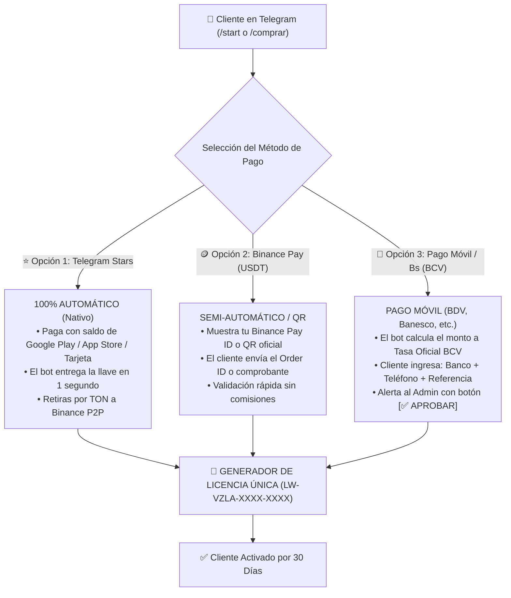
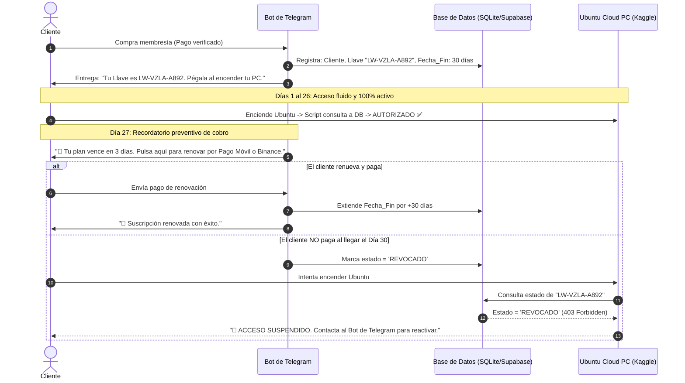

# 🇻🇪 SISTEMA AUTOMATIZADO DE COBROS, LICENCIAS Y BLOQUEO SELECTIVO POR TELEGRAM
## Arquitectura 100% Adaptada a Venezuela: Telegram Stars + Binance Pay + Pago Móvil ($0 Costos)

---

## 📌 PROPÓSITO DE ESTE INFORME
Este documento establece la arquitectura técnica, comercial y operativa para crear un **Bot de Telegram Automatizado en Python** capaz de vender, cobrar, emitir licencias de uso y bloquear selectivamente a clientes en Venezuela. 

El sistema soluciona de forma definitiva el problema del bloqueo de pasarelas internacionales (como Stripe o Gumroad), permitiendo pagos en **Telegram Stars, Binance Pay (USDT) y Pago Móvil / Transferencias en Bolívares**, con control de vencimiento a 30 días y revocación instantánea del acceso a la máquina virtual sin afectar a los demás usuarios.

---

## 1. 💳 LOS 3 RIELES DE PAGO ADAPTADOS A VENEZUELA

El bot integra los tres métodos de pago reales y operativos en el país:



### Detalle Operativo por Método:
1. **Telegram Stars (Estrellas de Telegram):**
   - Es la moneda digital oficial de Telegram. Funciona en todo el mundo y en Venezuela sin necesidad de VPN.
   - El cliente compra estrellas directamente en la app y paga con 1 toque.
   - Es **100% desatendido**: tú estás durmiendo y el bot cobra, genera la llave y se la entrega al cliente.
   - El saldo acumulado en Stars se retira a través de la plataforma oficial Fragment a una billetera TON y de ahí directo a tu Binance para vender por Pago Móvil en P2P.
2. **Binance Pay (Cripto / USDT):**
   - El método preferido por la comunidad gamer y de tecnología en Venezuela.
   - El bot entrega el monto exacto en USDT (ej. `$10.00`) y tu Pay ID.
   - Cero comisiones de red entre usuarios de Binance.
3. **Pago Móvil (Bancos Nacionales a Tasa BCV):**
   - El bot consulta automáticamente la API de la Tasa Oficial del Banco Central de Venezuela (BCV).
   - Genera los datos de Pago Móvil: Banco, Cédula y Teléfono.
   - El cliente envía los 6 dígitos de referencia bancaria o la captura.
   - **El Botón Mágico:** El bot te envía un mensaje privado a ti con el botón `[ ✅ APROBAR Y ENTREGAR LLAVE ]`. Con un solo toque en tu celular, el cliente queda activado.

---

## 2. 🔐 GESTIÓN DE LICENCIAS Y BLOQUEO SELECTIVO

### 2.1 Formato de la Llave de Licencia
Cada cliente recibe un código criptográfico único e intransferible:
```
LW-VZLA-A892-F41C-9901
```

### 2.2 Ciclo de Vida Automatizado de la Suscripción (30 Días)



### 2.3 Aislamiento Total (Los demás clientes no se enteran)
- La verificación es individual por token.
- Si el "Cliente A" no pagó, el script apaga la máquina **únicamente para el Cliente A**.
- El Cliente B, C y D siguen jugando y trabajando sin ninguna interrupción.

---

## 3. 🛠️ INTEGRACIÓN TÉCNICA EN `run_kaggle_vnc_studio.py`

En el script maestro de arranque de Ubuntu, se añade una función ligera de validación antes de levantar el escritorio gráfico:

```python
import os
import sys
import httpx

# 1. Capturar la llave introducida por el usuario
USER_KEY = os.environ.get("USER_LICENSE_KEY", "").strip()
API_VALIDATOR = "https://tu-bot-api.onrender.com/api/verify"

if not USER_KEY:
    print("\n" + "=" * 78)
    print("🛑 ERROR: No has ingresado tu Llave de Licencia.")
    print("👉 Adquiere o consulta tu llave en nuestro Bot de Telegram: @TuBotGaming_bot")
    print("=" * 78 + "\n")
    sys.exit(1)

# 2. Consultar al Bot en tiempo real (0.2 segundos)
try:
    with httpx.Client(timeout=10.0) as client:
        resp = client.post(API_VALIDATOR, json={"license_key": USER_KEY})
        data = resp.json()
        
        if resp.status_code != 200 or not data.get("is_active"):
            print("\n" + "=" * 78)
            print("🛑 ACCESO DENEGADO / SUSCRIPCIÓN VENCIDA")
            print(f"Motivo: {data.get('message', 'Pago pendiente o llave revocada.')}")
            print("👉 Renueva tu membresía en nuestro Bot de Telegram: @TuBotGaming_bot")
            print("=" * 78 + "\n")
            sys.exit(1) # Cierra el proceso inmediatamente
            
        print(f"✅ [✓] Licencia Activa ({data.get('days_left')} días restantes). ¡Bienvenido!", flush=True)
except Exception as e:
    print(f"⚠️ Error conectando con el servidor de licencias: {e}")
    sys.exit(1)
```

---

## 4. 🐍 CÓDIGO ESTRUCTURAL DEL BOT DE TELEGRAM (`bot_licencias.py`)

El bot se implementa con la librería moderna `python-telegram-bot` y una base de datos ultraligera:

```python
#!/usr/bin/env python3
"""
🤖 BOT DE GESTIÓN DE LICENCIAS Y COBROS VENEZUELA ($0 COSTOS)
"""
import uuid
from datetime import datetime, timedelta
from telegram import Update, InlineKeyboardButton, InlineKeyboardMarkup
from telegram.ext import Application, CommandHandler, CallbackQueryHandler, MessageHandler, filters, ContextTypes

ADMIN_CHAT_ID = 123456789 # Tu ID personal de Telegram
TOKEN = "TU_TELEGRAM_BOT_TOKEN"

# Simulación de Base de Datos en Memoria / SQLite
# Schema: { license_key: { "user_id": 123, "active": True, "expires": "2026-10-01", "username": "@carlos" } }
DATABASE = {}

async def start(update: Update, context: ContextTypes.DEFAULT_TYPE):
    teclado = [
        [InlineKeyboardButton("⭐ Pagar con Telegram Stars", callback_data="pay_stars")],
        [InlineKeyboardButton("🪙 Pagar con Binance Pay (USDT)", callback_data="pay_binance")],
        [InlineKeyboardButton("📱 Pagar con Pago Móvil (Bs)", callback_data="pay_pagomovil")],
        [InlineKeyboardButton("🔑 Consultar Mi Licencia", callback_data="check_license")]
    ]
    await update.message.reply_text(
        "👋 ¡Bienvenido a **Ubuntu Cloud PC Gaming & AI**!\n\n"
        "Obtén acceso a tu PC en la nube con 32GB RAM, GPU Tesla T4 y 20 Databases listas para jugar.\n\n"
        "Selecciona tu método de pago preferido para activar tu membresía de 30 días:",
        reply_markup=InlineKeyboardMarkup(teclado),
        parse_mode="Markdown"
    )

async def handle_buttons(update: Update, context: ContextTypes.DEFAULT_TYPE):
    query = update.callback_query
    await query.answer()
    
    if query.data == "pay_pagomovil":
        await query.message.reply_text(
            "📱 **DATOS DE PAGO MÓVIL (Tasa BCV):**\n\n"
            "• **Banco:** Banco de Venezuela (0102)\n"
            "• **Cédula:** V-09.032.000\n"
            "• **Teléfono:** 0414-XXXXXXX\n"
            "• **Monto:** Bs. 520 (Equivalente a $10)\n\n"
            "⚠️ Una vez realizado el pago, responde a este mensaje enviando el **número de referencia de 6 dígitos** o la captura del comprobante."
        )

# Función de aprobación del Dueño (Tú en 1 Clic)
async def aprobar_pago_admin(update: Update, context: ContextTypes.DEFAULT_TYPE):
    query = update.callback_query
    await query.answer()
    
    # Formato: "aprobar_<user_id>"
    user_id = int(query.data.split("_")[1])
    nueva_llave = f"LW-VZLA-{uuid.uuid4().hex[:8].upper()}"
    fecha_fin = datetime.now() + timedelta(days=30)
    
    DATABASE[nueva_llave] = {
        "user_id": user_id,
        "active": True,
        "expires": fecha_fin
    }
    
    # Notificar al dueño
    await query.edit_message_text(f"✅ Pago aprobado con éxito. Llave generada: `{nueva_llave}`")
    
    # Entregar al cliente automáticamente
    await context.bot.send_message(
        chat_id=user_id,
        text=(
            "🎉 **¡TU PAGO HA SIDO CONFIRMADO!**\n\n"
            f"🔑 **Tu Llave de Licencia:** `{nueva_llave}`\n"
            f"📅 **Válido hasta:** {fecha_fin.strftime('%Y-%m-%d')}\n\n"
            "👉 Pega esta llave en la variable `USER_LICENSE_KEY` en tu libreta para iniciar tu escritorio con todas las databases."
        ),
        parse_mode="Markdown"
    )
```

---

## 5. 🌐 ALOJAMIENTO GRATUITO 24/7 DEL BOT ($0 INVERSIÓN)

Para que el Bot esté activo día y noche sin que tu computadora o teléfono tengan que estar encendidos, se utiliza el nivel gratuito de las plataformas cloud modernas:

1. **Render.com / Koyeb (Hosting Gratuito):**
   - Te permiten desplegar el bot en Python de forma 100% gratuita.
   - Se conectan directamente a tu repositorio de GitHub y se actualizan solos cada vez que haces un cambio.
2. **Supabase (Base de Datos PostgreSQL Gratuita):**
   - Te regala una base de datos completa en la nube para registrar miles de clientes, fechas de vencimiento y llaves sin costo alguno.

---

## 6. 📋 RESUMEN DE VENTAJAS PARA TU NEGOCIO EN VENEZUELA
- **Inclusión total:** Cobras tanto a clientes que solo tienen cuenta en Bolívares como a quienes tienen USDT en Binance o saldo en Telegram.
- **Cero trabajo manual tedioso:** El bot entrega los datos bancarios, calcula la tasa BCV y tú solo tocas un botón de `[Aprobar]` desde tu celular.
- **Cobro recurrente garantizado:** El bot cobra solo, avisa 3 días antes de vencer y corta el acceso al día 30 si no renuevan.
- **Control absoluto:** Cada cliente tiene su propia llave; nadie te puede robar las bases de datos ni compartir el acceso sin pagar.

---
*Documento maestro archivado en el sistema local y almacenamiento raíz del dispositivo.*
