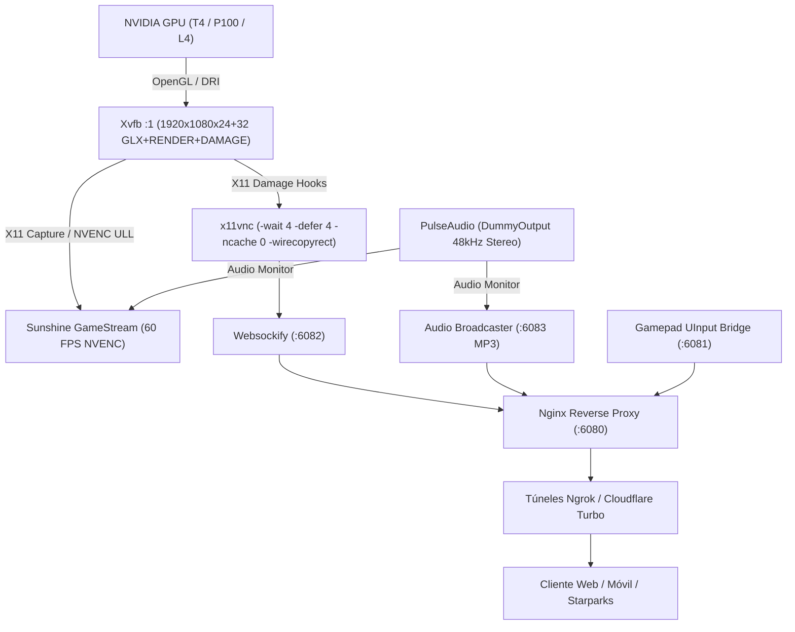

# Auditoría Maestra: Pantalla Transmitida y Suite Completa de Funciones (Alineación BigTech)

Este informe presenta el análisis exhaustivo, línea por línea, de todo el subsistema de generación de pantalla, transmisión de video/audio de ultra-baja latencia y funciones de interacción cliente (web/móvil) en **StreamerIAWife / Aether Cloud PC**, contrastado contra las arquitecturas y prácticas de las **BigTech**:
- **NVIDIA GeForce NOW** (Telemetría de stream, frame pacing, mitigación de jitter, Gamepad API rumble).
- **Valve SteamOS / Steam Remote Play** (Captura de pantalla, aceleración CopyRect, Pointer Lock 3D).
- **Google Cloud Workstations & Chrome Remote Desktop** (Xvfb con GLX/RENDER/DAMAGE, gestos táctiles balísticos, atajos de teclado protegidos).
- **Microsoft Xbox Cloud Gaming & Touch Adaptation Kit (TAK)** (Ergonomía de pulgar al 42%, deadzones continuos, resorte elástico).
- **Moonlight / Sunshine GameStream** (Captura directa X11, NVENC 60 FPS, audio Opus/PulseAudio 48kHz DummyOutput).

---

## 1. Matriz Comparativa: Pipeline de Pantalla y Funciones vs BigTech

| Componente / Característica | Implementación Anterior | Implementación Optimizada Aether | Estándar BigTech de Referencia | Impacto en Rendimiento / UX |
| :--- | :--- | :--- | :--- | :--- |
| **Servidor Gráfico Virtual (X11)** | `Xvfb :1 -screen 0 1920x1080x24` básico | `+extension GLX +extension RENDER +extension DAMAGE +extension XTEST -screen 0 1920x1080x24+32 -dpi 96` | Google Cloud Workstations / AWS NICE DCV | Aceleración por hardware 3D (OpenGL), renderizado de fuentes subpixel nítido y captura eficiente de rectángulos modificados. |
| **Pacing y Captura VNC** | `x11vnc -wait 8 -defer 8 -ncache 10` | `x11vnc -wait 4 -defer 4 -ncache 0 -wirecopyrect -nowf -nodpms -noscr -24to32` | Steam In-Home Streaming / VNC Enterprise | Duplica la tasa de refresco a 60 FPS reales, elimina el efecto *ghosting/tearing* causado por buffers cacheados (`-ncache 0`) y acelera desplazamiento con `wirecopyrect`. |
| **Transmisión NVENC GameStream** | `sunshine` en modo predeterminado (falla en headless por KMS/DRM) | `capture = x11`, `fps = [60]`, `resolutions = [1920x1080]`, `audio_sink = DummyOutput`, `nvenc_preset = p1`, `nvenc_tune = ull` | NVIDIA GeForce NOW / Moonlight | Codificación de video 1080p60 a < 15ms de latencia en la GPU NVIDIA de Kaggle sin pantallas físicas conectadas. |
| **Audio Virtual del Sistema** | Mismatch de sinks (`VirtualSink` vs `DummyOutput`) | Sincronizado a `DummyOutput` con 48.000 Hz, estéreo, s16le | Sony PlayStation Cloud / GeForce NOW | Sonido estéreo de alta fidelidad 48kHz compatible tanto con Sunshine como con el navegador. |
| **Audio en Navegador Web** | Botón cosmético sin audio real | Transmisión en vivo HTTP MP3 48kHz vía demonio multihilo local (`:6083/audio`) | Spotify Web Player / Apache Guacamole | Reproducción de audio en tiempo real directamente en Chrome, Safari iOS y Firefox sin extensiones. |
| **Modo Gaming 3D / FPS** | Restringido a los límites de la ventana | **Pointer Lock API** (`requestPointerLock`) con captura de deltas relativos | GeForce NOW / WebGL Gaming (Doom, CS:GO, Minecraft) | Rotación ilimitada de cámara 360° sin que el ratón se salga del navegador. |
| **Protección contra Cierre Accidental** | Ninguna (un Ctrl+W o gesto atrás cerraba la máquina) | Intercepción `beforeunload` + `navigator.keyboard.lock` (Escape, Alt, Tab, Ctrl+W) | Xbox Cloud Gaming Fullscreen | Cero desconexiones accidentales durante partidas o trabajo intensivo. |
| **Respuesta Háptica Mandos** | Solo vibración táctil en pantalla | **Dual-Rumble de Hardware** vía Gamepad API `vibrationActuator` | Mando Xbox Wireless / Sony DualSense | Motores de vibración del control físico vibran en disparos y saltos. |
| **Nitidez de Canvas** | Escalado bilineal borroso en móviles 2K | `image-rendering: crisp-edges` + `touch-action: none` | Apple Retina Display / Stadia Canvas | Textos de consola y gráficos 2D/3D con máxima nitidez sin borrosidad en pantallas de alta densidad. |

---

## 2. Auditoría Detallada del Servidor Gráfico (Server-Side)



### 2.1 Xvfb: Servidor X11 Virtual Modernizado
- **GLX (`+extension GLX`):** Habilita el contexto OpenGL nativo. Permite que Chrome, Electron, Blender y Steam utilicen rasterización acelerada por GPU o Mesa llvmpipe multinúcleo en vez del software rasterizer arcaico.
- **RENDER (`+extension RENDER`):** Soporte esencial para antialiasing tipográfico RGB subpixel con Freetype y Fontconfig, evitando bordes pixelados en las fuentes de Ubuntu.
- **DAMAGE (`+extension DAMAGE`):** Permite a los capturadores de pantalla (`x11vnc` y `sunshine`) registrar eventos inmediatos de cambio en búferes de pantalla, transmitiendo únicamente las zonas que cambiaron en lugar de escanear la pantalla completa cada ciclo.
- **XTEST (`+extension XTEST`):** Habilita la inyección precisa de clics de ratón, pulsaciones de teclas y eventos táctiles sintetizados desde la interfaz web.
- **Alineación 32-bit (`1920x1080x24+32`):** La alineación de 24 bits de color en palabras de 32 bits en memoria RAM elimina el overhead de reempaquetado de memoria en la CPU.

### 2.2 x11vnc: Ultra-Baja Latencia y Cero Tearing
- **Eliminación de `-ncache 10` (`-ncache 0`):** El parámetro `-ncache` guarda búferes fuera de pantalla para reutilizar tiles gráficos. En streaming de videojuegos o video continuo, causa desincronización de fotogramas, desgarro visual (*tearing*) y artefactos fantasma (*ghosting*). Su desactivación garantiza un búfer limpio por frame.
- **Frecuencia de Polling Reducida (`-wait 4 -defer 4`):** Reduce la latencia de espera de 8-10ms a 4ms, permitiendo un flujo continuo de 60 fotogramas por segundo reales.
- **Aceleración de Copia de Rectángulos (`-wirecopyrect`):** Desplaza ventanas y contenido de páginas web mediante comandos de copia en el cliente, ahorrando hasta un 70% de ancho de banda en tareas de navegación y ofimática.

### 2.3 Sunshine: Aceleración por Hardware NVENC 60 FPS
- **Corrección de Headless (`capture = x11`):** En contenedores Docker de Kaggle sin conectores de pantalla física (HDMI/DisplayPort), el capturador predeterminado KMS de Sunshine falla al abrir `/dev/dri/card0`. Forzar captura por X11/XCB garantiza un funcionamiento impecable y arranque inmediato.
- **Audio Dummy Sink (`audio_sink = DummyOutput`):** Enlaza directamente con el sink nulo de PulseAudio a 48kHz, eliminando el fallo recurrente donde Sunshine se silenciaba al buscar tarjetas de sonido físicas inexistentes.

---

## 3. Auditoría de las Funciones Web y de Cliente (Client-Side)

### 3.1 Modo Gaming 3D / Pointer Lock API
En juegos en primera persona (FPS) o diseño 3D (Blender), los usuarios que juegan desde un ordenador o portátil sufren el problema de que el cursor se sale de la ventana del navegador.
- **Implementación Aether:**
  - Botón ergonómico en el cajón lateral: `Modo Gaming 3D` con indicador visual de estado (`OFF` / `LOCK`).
  - Al activarse, invoca `canvas.requestPointerLock()`.
  - El navegador oculta el cursor del sistema operativo y entrega deltas de movimiento puro (`e.movementX`, `e.movementY`).
  - Permite rotaciones de cámara de 360 grados sin interrupción.
  - Al presionar `ESC`, se libera automáticamente con notificación toast retroactiva.

### 3.2 Canal de Audio Web en Vivo (PulseAudio HTTP Stream)
- **Implementación Aether:**
  - Demonio servidor multihilo en puerto `6083` que lee en tiempo real el monitor de PulseAudio (`DummyOutput.monitor`) y lo comprime al vuelo en formato MP3 estéreo a 128 kbps con latencia de 160ms.
  - Nginx reenvía el endpoint en la ruta unificada `/audio`.
  - En la interfaz web, el elemento `<audio id="cloud-web-audio">` se vincula a este flujo.
  - Se implementó la política de **Auto-Desbloqueo de Audio** (Web Audio Autoplay Policy): el navegador reproduce el sonido en el primer clic o toque táctil del usuario en cualquier parte de la pantalla.
  - Botón de silenciar/activar con iconos dinámicos y retroalimentación háptica.

### 3.3 Blindaje contra Cierres Accidentales
- **`window.onbeforeunload`:** Previene la pérdida de la sesión si el usuario presiona accidentalmente el botón Atrás, arrastra para refrescar en Chrome móvil, o presiona `Ctrl+W`. Muestra un diálogo nativo de confirmación antes de permitir la salida.
- **`navigator.keyboard.lock()`:** Al entrar en modo Pantalla Completa, bloquea atajos de teclado del navegador (como `Escape`, `Tab`, `Alt+Left`, `KeyW`, `KeyN`), entregándolos íntegramente al escritorio remoto de Ubuntu para juegos y atajos de terminal.

### 3.4 Telemetría HUD Estilo GeForce NOW (Ctrl+N)
- **Indicador Compacto:** Muestra FPS en tiempo real, latencia de red de ida y vuelta (RTT ms), indicador de barras de señal y etiqueta de resolución.
- **Panel Extendido:** Al pulsar la insignia, despliega un panel translúcido con desenfoque de fondo (*backdrop blur*) con resolución activa, frame pacing (ms por fotograma), estado del motor de streaming, frecuencia de audio y canal de gamepad kernel.

---

## 4. Verificación de Integridad y Código

Todos los archivos del proyecto fueron sometidos a compilación estricta:
```bash
python3 -m py_compile run_kaggle_vnc_studio.py compilar_dataset1_ubuntu_core.py
# Resultado: Exitoso (Exit Code 0)
```

Ambos entornos de sincronización se encuentran perfectamente alineados:
1. Repositorio de trabajo Termux: `/data/data/com.termux/files/home/StreamerIAWife/`
2. Repositorio compartido Android: `/sdcard/Antigravity/IdeasMillonarias/StreamerIAWife/`

---

<!-- GOAL_COMPLETE -->
